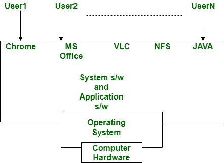

# 应用软件和操作系统的区别

> 原文:[https://www . geesforgeks . org/应用软件和操作系统的区别/](https://www.geeksforgeeks.org/difference-between-application-software-and-operating-system/)

**[应用软件](https://www.geeksforgeeks.org/software-concepts/) :**
应用软件是根据用户请求运行或执行的软件类型之一。高级语言如 java、c、c++等被用来开发应用软件。应用软件是一种特定用途的软件，旨在一起执行一些任务。没有操作系统就不能安装应用软件。它的例子有 Photoshop，VLC 媒体播放器，Mozilla Firefox，Opera，谷歌 chrome 等。

**[操作系统](https://www.geeksforgeeks.org/introduction-of-operating-system-set-1/) :**
操作系统是计算机程序，作为用户和硬件的接口，为计算机程序提供通用服务。计算机系统的整个过程或功能取决于操作系统。它是用 c++、c、汇编语言开发的。

操作系统执行各种任务，如管理文件和目录的创建和删除、进程的创建、删除、同步、内存分配和释放。操作系统还防止计算机系统未经授权的访问，并保护资源、信息和数据。它的例子有微软视窗、Linux、Unix、DOS。总的来说，我们可以说没有操作系统，计算机系统什么都不是。

在上图中，我们可以清楚地看到，系统和应用程序或软件依赖于作为用户和计算机硬件之间接口的操作系统。

**应用软件与操作系统的区别:**

| S.NO | 应用软件 | 操作系统 |
| --- | --- | --- |
| 1. | 一种计算机程序，用于执行某些分类任务。 | 管理硬件和软件资源并为计算机程序提供公共服务的系统计算机程序。 |
| 2. | 应用软件从互联网下载。 | 购买的设备上安装了操作系统。 |
| 3. | 它是用虚拟 basic、c++、c、java 开发的。 | 它是用 c++、c、汇编语言开发的。 |
| 4. | 它通常以兆字节为单位。 | 而它通常是千兆字节。 |
| 5. | 它是为执行某些特定任务而构建的。 | 它作为用户和硬件之间的接口，执行各种任务，如内存管理、调度、进程管理等。 |
| 6. | 这总是取决于操作系统。 | 但是它不依赖于应用软件，它提供了执行或运行应用软件的路径。 |
| 7. | 它在用户希望运行应用程序时运行。 | 它在用户需要时启动并运行，直到用户关闭机器。 |
| 8. | 它的例子是 Photoshop，VLC 播放器等。 | 它的例子有微软视窗、Linux、Unix、DOS。 |

