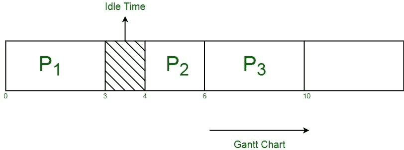

# CPU 调度中到达时间和突发时间的差异

> 原文:[https://www . geeksforgeeks . org/到达时间和突发 cpu 调度时间之差/](https://www.geeksforgeeks.org/difference-between-arrival-time-and-burst-time-in-cpu-scheduling/)

[CPU 调度算法](https://www.geeksforgeeks.org/cpu-scheduling-in-operating-systems/)要求其执行所需的 CPU 时间和 IO 时间。中央处理器时间是中央处理器执行进程所花费的时间，而输入/输出时间说明了进程进行输入/输出操作所需的时间。

以优化方式执行多个进程是基于不同类型的算法，如 FCFS、最短作业优先等。，这取决于时间帧值，如到达时间、突发时间、等待时间等。

**1。到达时间(AT) :**
到达时间是进程到达就绪队列开始执行的时间点，单位为毫秒。它只是独立于中央处理器或输入/输出时间，只是描述了进程可以完成其指定作业的时间范围。该进程与处于运行状态的进程无关。到达时间可以计算为流程的完成时间和周转时间之差。

```
Arrival Time (A.T.) 
= Completion Time (C.T.) - Turn Around Time (T.A.T) 
```

**2。突发时间(BT) :**
突发时间是指进程执行所需的时间，单位为毫秒。突发时间考虑了进程的中央处理器时间。不考虑输入输出时间。它被称为进程的执行时间或运行时间。在此时间段内，流程从运行状态转换到完成状态。突发时间可以计算为进程的完成时间和等待时间之差，即，

```
Burst Time (B.T.) 
= Completion Time (C.T.) - Waiting Time (W.T.) 
```

下表说明了三个进程 P1、P2 和 P3 的到达和爆发时间。为这些进程的执行分配了一个 CPU。

<center>

| 处理 | 到达时间(毫秒) | 突发时间(毫秒) |
| --- | --- | --- |
| 第一亲代 | Zero | three |
| P2 | four | Two |
| P3 | six | four |

</center>

如果我们计算甘特图，基于 FCFS 调度，在就绪队列中排在第一位的进程首先被执行。进程的到达决定了进程在与其突发时间相等的时间内的执行顺序。



因为，进程 P2 达到 4 毫秒，进程 P1 需要 3 毫秒来执行(=突发时间)，所以中央处理器等待 1 毫秒，这是中央处理器的空闲时间，它不执行任何进程执行。最后一个被处决的是 P3。

下表分别说明了到达时间和突发时间的主要差异:

<center>

| 到达时间 | 突发时间 |
| --- | --- |
| 标记队列中进程的入口点。 | 在队列中标记进程的退出点。 |
| 在进程执行前计算。 | 在进程执行后计算。 |
| 与中央处理器的就绪状态相关。 | 与中央处理器的运行状态相关。 |

</center>