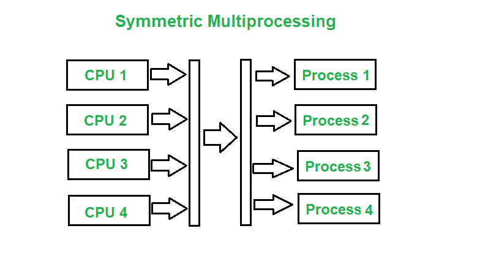

# 不对称和对称多处理的区别

> 原文:[https://www . geeksforgeeks . org/非对称和对称多处理的区别/](https://www.geeksforgeeks.org/difference-between-asymmetric-and-symmetric-multiprocessing/)

**多处理**是在单个计算机系统中使用两个或多个中央处理单元。**非对称多处理和对称多处理**是多处理的两种类型。

**非对称多处理:**
非对称多处理系统是一种多处理器计算机系统，其中并不是所有的多个互连的中央处理器(CPU)都被同等对待。在非对称多处理中，只有主处理器运行操作系统的任务。
例如，AMP 可以用于根据任务完成的优先级和重要性将特定任务分配给 CPU。

**对称多处理:**
它涉及一种多处理器计算机硬件和软件架构，其中两个或多个相同的处理器连接到单个共享主存储器，可以完全访问所有输入和输出设备，换句话说，对称多处理是一种多处理类型，其中每个处理器都是自调度的。
例如，SMP 将多个处理器应用于那个问题，称为并行编程。

**非对称和对称多处理的区别:**

<figure class="table">

| 不对称多处理 | 对称多处理 |
| --- | --- |
| 在非对称多处理中，处理器没有被同等对待。 | 在对称多处理中，所有的处理器都被同等对待。 |
| 操作系统的任务由主处理器完成。 | 操作系统的任务由单个处理器完成 |
| 处理器之间没有通信，因为它们由主处理器控制。 | 所有处理器通过共享内存与另一个处理器通信。 |
| 在非对称多处理中，进程是主从。 | 在对称多处理中，进程取自就绪队列。 |
| 非对称多处理系统更便宜。 | 对称多处理系统成本更高。 |
| 不对称多处理系统更容易设计 | 对称多处理系统设计复杂 |

</figure>