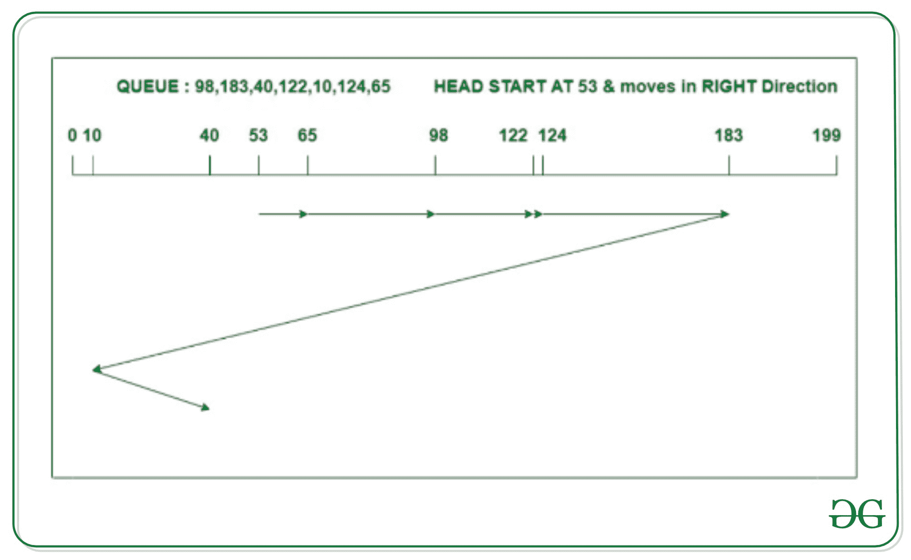
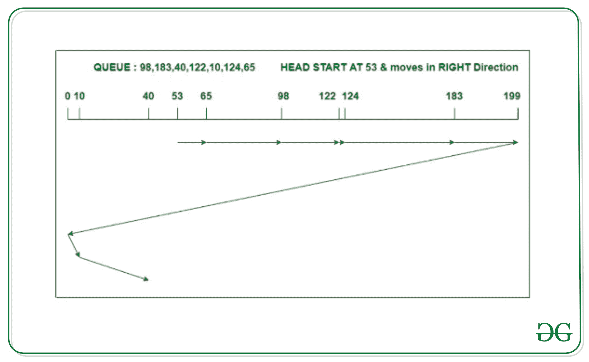

# C-LOOK 和 C-SCAN 磁盘调度算法的区别

> 原文:[https://www . geesforgeks . org/c-look-and-c-scan-disk-scheduling-algorithm/](https://www.geeksforgeeks.org/difference-between-c-look-and-c-scan-disk-scheduling-algorithm/)

#### **[C-LOOK 磁盘调度算法](https://www.geeksforgeeks.org/c-look-disk-scheduling-algorithm/)**

C-LOOK 是 LOOK 和 C-扫描算法的修改版本。在这种算法中，头部从第一个请求开始向一个方向移动，并向另一端的最后一个请求移动，为中间的所有请求提供服务。在一端到达最后一个请求后，头部向另一个方向跳跃，并向剩余的请求移动，然后以与之前相同的方向满足它们。与 C-SCAN 不同，头指针将移动到磁盘的结束请求。

**示例:**

考虑一个具有 200 个磁道(0-199)的磁盘，该磁盘队列具有如下顺序的输入/输出请求:

```
98, 183, 40, 122, 10, 124, 65

```

读/写磁头的当前磁头位置是 53，并将向右移动。使用 C-LOOK 算法计算读/写磁头的磁道移动总数。



```
Total head movements
= (65 - 53) + (98 - 65)
  + (122 - 98)
  + (124 - 122) + (183 - 124)
  + (183 - 10) + (40 - 10)
= 333

```

#### **[C-SCAN 磁盘调度算法](https://www.geeksforgeeks.org/c-scan-disk-scheduling-algorithm/)**

C-scan 算法，也称为循环电梯算法，是 scan 算法的修改版。在这个算法中，头指针从磁盘的一端开始，向另一端移动，服务于其间的所有请求。到达另一端后，头部反转方向，前往起点。然后，它以与之前相同的方向满足剩余的请求。与 C-LOOK 不同，不管是否有请求，头指针都会移动到磁盘的末尾。

**示例–**

考虑一个具有 200 个磁道(0-199)的磁盘，该磁盘队列具有如下顺序的输入/输出请求:

```
98, 183, 40, 122, 10, 124, 65

```

读/写磁头的当前磁头位置是 53，并将向右移动。使用 C 扫描算法计算读/写磁头的磁道移动总数。



```
Total head movements
= (65 - 53) + (98 - 65)
   + (122 - 98)
   + (124 - 122) + (183 - 124)
   + (199 - 183) + (199 - 0)
   + (10 - 0) + (40 - 10)
= 395

```

### **C-LOOK 和 C-SCAN 磁盘调度算法的区别**

<figure class="table">

|   | **C-LOOK** | **碳扫描** |
| --- | --- | --- |
| one | C-LOOK 算法是所有磁盘调度算法中性能最好的。 | 然而，与 C-LOOK 相比，C-SCAN 在性能上滞后 |
| Two | C-LOOK 算法比 C-SCAN 更能有效地处理请求。 | 这里的请求处理不如 C-LOOK 算法好。 |
| three | 在 C-LOOK 算法的上述例子中，头部从 53 开始移动，以正确的方向服务所有请求，直到它到达一端的最后一个请求。然后，它跳转到剩余的请求，只向正确的方向提供服务。 | 在上面的 C-SCAN 算法示例中，头部从 53 开始移动，以正确的方向服务所有请求，直到到达另一端。然后它跳到另一端，只向正确的方向提供剩余的请求。 |
| four | C-LOOK 在响应时间和等待时间上的差异很小。 | C-SCAN 提供统一的等待时间和响应时间。 |
| five | 在 C-LOOK 算法中，有一个寻找最终请求的开销。 | 与 C-LOOK 相比，C-SCAN 算法导致更多的寻道时间。 |

</figure>