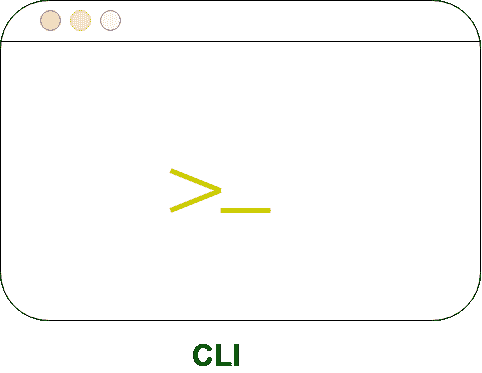
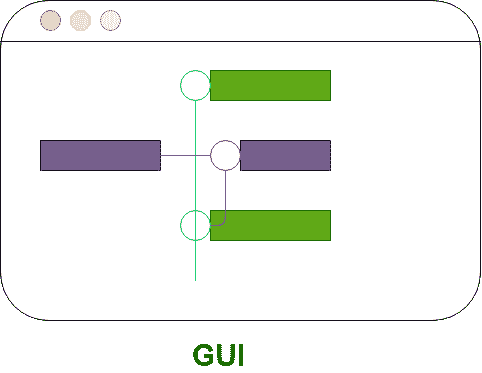

# CLI 和 GUI 的区别

> 原文:[https://www . geesforgeks . org/CLI 和 gui 之间的区别/](https://www.geeksforgeeks.org/difference-between-cli-and-gui/)

**CLI** 是用于**命令行界面的单词形式。**命令行界面允许用户在终端或控制台窗口中大量输入与操作系统交互的命令。命令行界面是一个平台或媒介，用户可以通过编写命令来响应可见的提示，并从系统获得响应，因此用户必须被迫输入命令或命令序列来执行任务。命令行界面适用于价格昂贵的计算，只要输入正确是优先考虑的。

**GUI** 代表**图形用户界面。**图形用户界面允许用户使用图形与操作系统交互。在图形用户界面中，提供了菜单，例如:窗口、滚动条、按钮、向导、绘画图片、可选图标等。它直观、简单，可以发现并减少心理特征负荷。在图形用户界面中，信息以任何形式显示或呈现给用户，例如:纯文本、视频、图像等。

让我们看看图形用户界面和命令行界面的区别:

| S.NO | 硬币指示器 （coin-levelindicator 的缩写）命令行界面（Command Line Interface for batch scripting） | 图像使用者界面 |
| --- | --- | --- |
| 1. | 命令行界面很难使用。 | 然而它很容易使用。 |
| 2. | 它消耗低内存。 | 同时消耗更多内存。 |
| 3. | 在命令行界面中，我们可以获得高精度。 | 而在其中，获得了低精度。 |
| 4. | 命令行界面比图形用户界面快。 | 图形用户界面的速度比命令行界面慢。 |
| 5. | CLI 操作系统只需要键盘。 | 而 GUI 操作系统则需要鼠标和键盘两者。 |
| 6. | 命令行界面的外观不能修改或更改。 | 虽然它的外观可以修改或改变。 |
| 7. | 在 CLI 中，输入仅在命令提示符下输入。 | 在图形用户界面中，输入可以在屏幕上的任何地方输入。 |
| 8. | 在 CLI 中，信息以纯文本和文件的形式显示或呈现给用户。 | 在图形用户界面中，信息以任何形式显示或呈现给用户，例如:纯文本、视频、图像等。 |
| 9. | 在命令行界面中，没有提供菜单。 | 在图形用户界面中，提供了菜单。 |
| 10. | 命令行界面中没有图形。 | 在图形用户界面中，使用图形。 |
| 11. | 命令行界面不使用任何指向设备。 | 而它使用定点设备来选择和选择项目。 |
| 12. | 在 CLI 中，拼写错误和键入错误是无法避免的。 | 而在图形用户界面中，拼写错误和打字错误被避免。 |