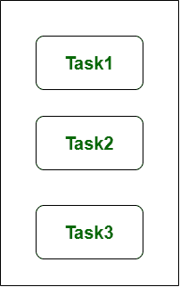
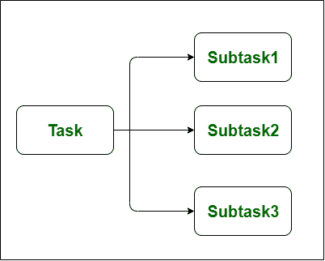

# 并发和并行的区别

> 原文:[https://www . geesforgeks . org/并发与并行的区别/](https://www.geeksforgeeks.org/difference-between-concurrency-and-parallelism/)

**并发:**
并发指的是同时处理多个任务的应用程序。并发是一种通过使用单个处理单元来减少系统响应时间的方法。并发性造成了并行的假象，然而实际上任务的块并没有被并行处理，但是在应用程序内部，一次有多个任务被处理。在一项任务开始之前，它不会完全结束。
通过中央处理器(CPU)上进程的交错操作，或者换句话说，通过上下文切换，实现并发。这是基本原理，就像并行处理一样。它增加了一次完成的工作量。

在上图中，我们可以看到**有多个任务同时进行进度。**这个图展示了并发性，因为并发性是一次处理很多事情的技术。

**并行性:**
并行性与一种应用有关，在这种应用中，任务被分成看似同时或并行处理的更小的子任务。它用于通过使用多个处理器来提高系统的吞吐量和计算速度。它使单个顺序 CPU 能够“看似”同时完成许多事情。

并行性导致一个进程中的中央处理器和输入输出任务与另一个进程的中央处理器和输入输出任务重叠。而在并发中，速度是通过将一个进程的输入输出活动与另一个进程的 CPU 进程重叠来提高的。

在上图中，我们可以看到**任务被划分为更小的子任务，这些子任务同时或并行处理。**此图显示了并行性，即同时运行线程的技术。

**并发和并行的区别:-**

<figure class="table">

| S.NO | 并发 | 平行 |
| --- | --- | --- |
| 1. | 并发性是同时运行和管理多个计算的任务。 | 而并行是同时运行多个计算的任务。 |
| 2. | 并发性是通过中央处理器上的进程交错操作实现的，换句话说，是通过上下文切换实现的。 | 而它是通过多个中央处理器来实现的。 |
| 3. | 并发性可以通过使用单个处理单元来实现。 | 虽然这不能通过使用单个处理单元来实现。它需要多个处理单元。 |
| 4. | 并发性增加了一次完成的工作量。 | 同时提高了系统的吞吐量和计算速度。 |
| 5. | 并发同时处理很多事情。 | 同时做很多事情。 |
| 6. | 并发是一种非确定性的控制流方法。 | 而它是确定性控制流方法。 |
| 7. | 在并发中调试是非常困难的。 | 虽然在这种情况下，调试也很难，但比并发简单。 |

</figure>