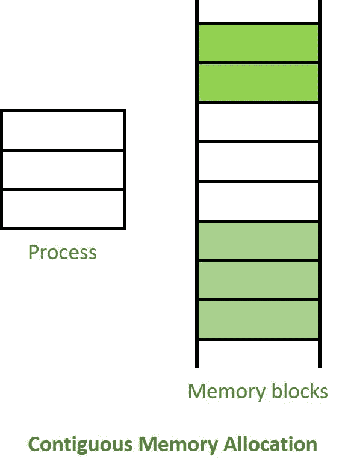
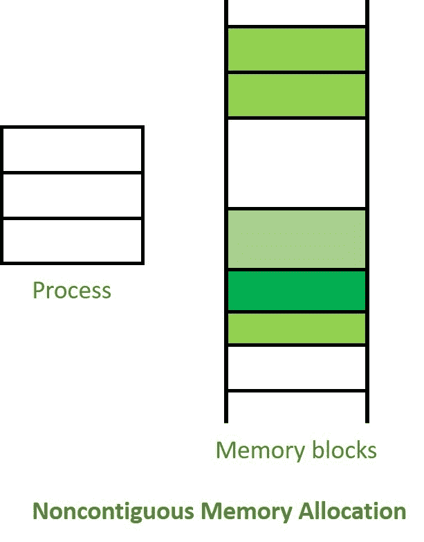

# 连续和非连续内存分配的差异

> 原文:[https://www . geeksforgeeks . org/连续和非连续内存分配之间的差异/](https://www.geeksforgeeks.org/difference-between-contiguous-and-noncontiguous-memory-allocation/)

**1。连续内存分配:**
连续内存分配基本上是一种将单个连续的内存段/部分分配给需要它的进程或文件的方法。因此，所有可用的内存空间都驻留在同一个地方，这意味着自由/未使用的可用内存分区不会以随机的方式分布在整个内存空间中。

主存储器是两个主要部分的组合，一个用于操作系统，另一个用于用户程序。我们可以通过将内存分区划分为固定大小的分区来实现连续内存分配。

**2。非连续内存分配:**
非连续内存分配基本上是一种方法，与连续分配方法相反，它根据进程的要求将内存空间分配到不同的位置。由于所有可用的内存空间都是分布式的，因此自由可用的内存空间也分散在各处。
这种内存分配技术有助于减少内存浪费，最终导致内部和外部碎片。

**连续和非连续内存分配的区别:**

| 没有 | 连续内存分配 | 非连续内存分配 |
| --- | --- | --- |
| 1. | 连续内存分配将连续的内存块分配给文件/进程。 | 非连续内存分配将单独的内存块分配给文件/进程。 |
| 2. | 执行速度更快。 | 执行速度较慢。 |
| 3. | 操作系统更容易控制。 | 操作系统很难控制。 |
| 4. | 开销最小，因为在执行一个进程时没有太多的地址转换。 | 由于地址翻译越来越多，开销也越来越大。 |
| 5. | 内部碎片和外部碎片都出现在连续内存分配方法中。 | 非连续内存分配方法中会出现外部碎片。 |
| 6. | 它包括单分区分配和多分区分配。 | 它包括分页和分段。 |
| 7. | 浪费内存是存在的。 | 没有内存浪费。 |
| 8. | 在连续内存分配中，换入进程被安排在最初分配的空间中。 | 在非连续内存分配中，换入进程可以安排在内存中的任何位置。 |