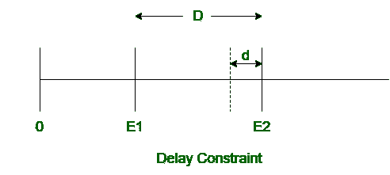

# 实时系统中延迟和截止时间约束的区别

> 原文:[https://www . geeksforgeeks . org/实时系统延迟和截止日期限制之间的差异/](https://www.geeksforgeeks.org/difference-between-delay-and-deadline-constraint-in-real-time-system/)

先决条件–[实时系统中的时间限制](https://www.geeksforgeeks.org/timing-constraints-in-real-time-system/)
**1。延迟约束:**
延迟约束是实时系统中两个连续事件发生之间的最小时间间隔。如果事件发生在延迟约束之前，则称为延迟违规。两个事件发生之间的时间间隔应大于或等于延迟限制。
如果 D 是两个事件发生之间的实际时间间隔，D 是延迟约束，那么 **D > = d** 。

**2。截止时间约束:**
截止时间约束是实时系统中两个连续事件发生之间的最大时间间隔。如果事件发生在截止日期限制之后，则事件的结果被认为是不正确的。两个事件发生之间的时间间隔应小于或等于截止日期限制。
如果 D 是两个事件发生之间的实际时间间隔，D 是截止时间约束，那么 **D < = d** 。

**延迟和截止日期限制的区别:**

| 延迟约束 | 截止日期约束 |
| --- | --- |
| 这是两个连续事件发生之间的最小时间间隔。 | 这是两个连续事件发生之间的最大时间间隔。 |
| 这意味着在事件 E 1 发生之后，事件 E 2 只有在经过的时间等于延迟约束之后才能发生。 | 这意味着在事件 E 1 发生之后，事件 E 2 必须仅在经过的时间等于截止时间约束之前发生。 |
| 如果 D 是两个事件发生之间的实际时间间隔，D 是延迟约束，那么 **D > = d** 。 | 如果 D 是两个事件发生之间的实际时间间隔，D 是截止时间约束，那么 **D < = d** 。 |
| 如果事件发生在延迟约束之前，就会发生延迟冲突。 | 如果事件发生在截止日期限制之后，则不存在截止日期违规这样的术语。 |
| 如果事件发生在延迟约束之前，则不会认为结果不正确。 | 如果事件发生在截止日期限制之后，则认为结果不正确。 |
| 绩效下的延迟约束分为反应-反应和刺激-反应。 | 绩效下的期限约束分为刺激反应和反应反应。 |
| 绩效下的延迟约束分为反应-刺激和刺激-刺激。 | 绩效下的期限约束分为刺激-刺激和反应-刺激。 |

