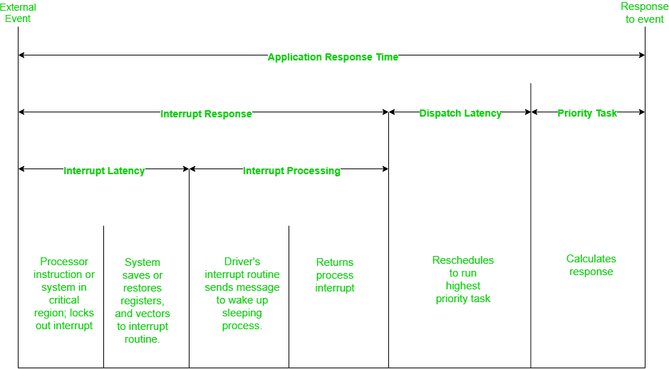
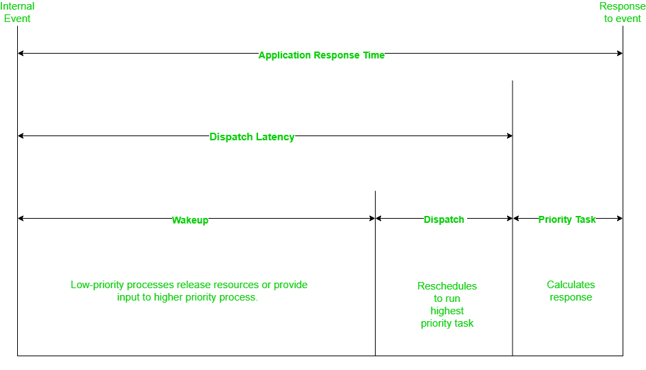
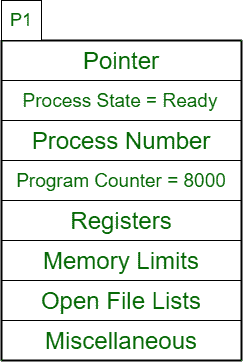
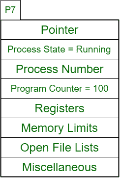

# 操作系统中“调度延迟”和“上下文切换”的区别

> 原文:[https://www . geesforgeks . org/操作系统中调度延迟和上下文切换的区别/](https://www.geeksforgeeks.org/difference-between-dispatch-latency-and-context-switch-in-operating-systems/)

多任务系统中的一个进程被从辅助存储器带到主存储器，有时又被切换回辅助存储器。因此，一个过程在其整个生命周期中有几个[状态](https://www.geeksforgeeks.org/states-of-a-process-in-operating-systems/)。上下文切换是整个生命周期的重要组成部分。

**调度器**是一个模块，它将 CPU 的控制权交给短期调度器选择的进程，这包括:

*   切换上下文
*   切换到用户模式
*   跳到用户程序中的适当位置继续执行该程序。

**上下文切换:**
是存储旧进程的状态，并通过上下文切换为新进程加载保存的状态的过程。过程的上下文在印刷电路板(过程控制块)中表示。
在上下文切换期间，进程的属性(如寄存器、指针、程序计数器等)都存储在印刷电路板上，并保存在内核内存中的每个进程堆栈中，如果是旧进程，则通过更新其印刷电路板，如果是新进程，则通过创建新印刷电路板来取代新进程。
上下文切换提供了高度的多任务处理能力，有助于更好地利用操作系统。

**调度等待时间:**
**是调度程序将一个进程从运行状态上下文切换到另一个进程运行状态所花费的时间。
调度延迟是一个开销，在上下文切换时，系统不做任何有用的工作。
一些硬件为每个 CPU 提供多组寄存器，允许一次加载多个上下文。**

**

应用程序响应时间内调度延迟的位置** 

**调度延迟只是整个应用程序响应时间的一小部分。**

**

应用程序响应时间内调度延迟的扩展视图** 

**调度延迟包括旧任务释放其资源(唤醒)，然后重新调度新任务(调度)，所有这些都在上下文切换之下。
让我们看一个例子来理解上下文切换和调度延迟。**

****示例–****

****优先–**T2】P1>P2>P3>P4>P5>P6**

****就绪队列–****

<figure class="table">

| P2 | P3 | P4 | 孕烯醇酮 | P6 |

****跑步–****

<figure class="table">

| 第一亲代 |

**优先级大于 P1 的任务 P7 进入就绪队列。**

****现在就绪队列将为–****

<figure class="table">

| P2 | P3 | P4 | 孕烯醇酮 | P6 | P7 |

</figure>

**短期调度程序选择 P7 在运行状态下与 P1 交换。**

****上下文切换–**
**1。** P1 的上下文(PCB)被保存并存储在内核内存中的每进程堆栈中。**

****

****2。** P7 的上下文(PCB)更新。**

****

**步骤 1 和 2 中经过的时间是**调度等待时间**。**

****跑步–****

<figure class="table">

| P7 |

**“上下文切换”和“调度延迟”都与调度程序有关，调度程序在短期调度程序决定将哪个进程从就绪队列带入运行状态后开始发挥作用。**

<figure class="table">

| 调度延迟 | 上下文开关程序 |
| --- | --- |
| 调度程序暂停一个进程
并启动另一个进程所花费的时间量称为调度延迟。 | 保存先前运行的进程或线程的状态
并由调度程序加载新进程的初始或先前保存的状态的过程。 |
| 调度延迟是一个时间值。 | 语境转换是一个过程。 |
| 这是语境转换的结果。 | 当中断启动时，由调度程序执行。 |
| 延迟取决于硬件支持。 | 操作系统和印刷电路板越复杂，上下文切换就越长。 |

</figure>

</figure>

</figure>

</figure>