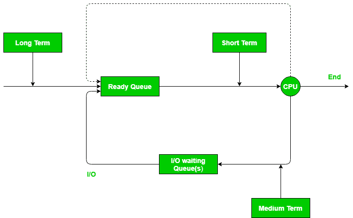
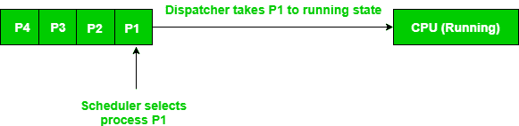

# 调度程序和调度程序的区别

> 原文:[https://www . geesforgeks . org/调度程序和调度程序之间的区别/](https://www.geeksforgeeks.org/difference-between-dispatcher-and-scheduler/)

调度器是以各种方式处理进程调度的专用系统软件。他们的主要任务是选择要提交到系统中的作业，并决定运行哪个进程。有[三种调度器](https://www.geeksforgeeks.org/gate-notes-operating-system-scheduler/):

1.  **Long term (job) scheduler –** Due to the smaller size of main memory initially all program are stored in secondary memory. When they are stored or loaded in the main memory they are called process. This is the decision of long term scheduler that how many processes will stay in the ready queue. Hence, in simple words, long term scheduler decides the degree of multi-programming of system.
2.  **中期调度器–**通常，一个正在运行的进程需要不需要 CPU 的 I/O 操作。因此，在进程执行期间，当需要输入/输出操作时，操作系统会将该进程从运行队列发送到阻塞队列。当一个进程完成它的输入输出操作时，它应该再次转移到就绪队列。所有这些决定都由中期计划员做出。中期计划是**交换**的一部分。
3.  **Short term (CPU) scheduler –** When there are lots of processes in main memory initially all are present in the ready queue. Among all of the process, a single process is to be selected for execution. This decision is handled by short term scheduler.

    让我们看看下面给出的图。它可能会让你看得更清楚。

    

**调度程序–**
调度程序是在调度程序之后开始运行的特殊程序。当调度程序完成选择一个进程的工作时，调度程序会将该进程带到所需的状态/队列。调度程序是一个模块，在短期调度程序选择了中央处理器后，它对中央处理器进行进程控制。该功能包括以下内容:

*   切换上下文
*   切换到用户模式
*   跳转到用户程序中的适当位置以重新启动该程序

**调度程序和调度程序的区别–**
考虑一种情况，其中各种进程驻留在等待执行的就绪队列中。CPU 无法同时执行所有这些进程，因此操作系统必须根据所使用的调度算法来选择特定的进程。因此，在各种进程中选择一个进程的过程是由调度程序的**完成的。一旦调度程序从队列中选择了一个进程，**调度程序**进入画面，正是调度程序将该进程从就绪队列中取出，并将其移动到运行状态。因此，调度程序给调度程序一个有序的进程列表，调度程序随时间移动到中央处理器。**

**例–**
就绪队列中有 4 个进程，P1、P2、P3、P4；它们的到达时间分别为 t0、t1、t2、t3。使用先进先出(FIFO)调度算法。因为 P1 最先到达，调度程序将决定它是应该执行的第一个进程，调度程序将从就绪队列中删除 P1，并将其交给中央处理器。然后，调度程序将确定 P2 是下一个应该执行的进程，因此当调度程序返回到新进程的队列时，它将接受 P2 并将其交给 CPU。P3 也是如此，P4 也是如此。

| 性能 | 分配器 | 调度程序 |
| --- | --- | --- |
| 定义: | 调度程序是一个模块，它把中央处理器的控制权交给短期调度程序选择的进程 | 调度程序是在各种进程中选择一个进程的东西 |
| 类型: | 调度程序中没有不同的类型。它只是一个代码段。 | 有 3 种类型的调度程序，即长期、短期、中期 |
| 依赖性: | 调度程序的工作依赖于调度程序。意味着调度程序必须等待调度程序选择一个进程。 | 调度程序独立工作。需要时，它会立即工作 |
| 算法: | Dispatcher 没有实现它的特定算法 | 调度器工作在各种算法上，如 FCFS、SJF、RR 等。 |
| 花费的时间: | 调度程序花费的时间称为调度延迟。 | 调度程序花费的时间通常可以忽略不计。因此我们忽略了它。 |
| 功能: | 调度程序还负责:上下文切换，切换到用户模式，当进程再次重新启动时跳转到适当的位置 | 调度器唯一的工作就是选择进程。 |