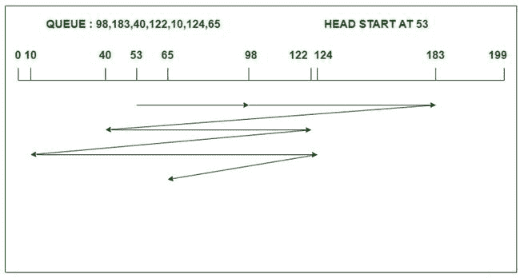

# 【FCFS 和 C-LOOK 磁盘调度算法的区别

> 原文:[https://www . geeksforgeeks . org/区别-FCFS-和-c-look-磁盘-调度-算法/](https://www.geeksforgeeks.org/difference-between-fcfs-and-c-look-disk-scheduling-algorithm/)

### 1. [FCFS 磁盘调度算法](https://www.geeksforgeeks.org/fcfs-disk-scheduling-algorithms/)

FCFS 代表[先到先服务](https://www.geeksforgeeks.org/first-come-first-serve-cpu-scheduling-non-preemptive/)，该算法按照任务到达磁盘队列的顺序来处理任务。它是最简单易懂的磁盘调度算法。在这种情况下，头或指针向任务到达的方向移动，并一直移动到所有请求都被处理完。然而，FCFS 算法在处理即将到来的请求时有一个更公平的策略。与所有其余的磁盘调度算法相比，FCFS 算法在性能上有所滞后。

**示例:**

考虑一个有 200 个磁道(0-199)的磁盘，磁盘队列中有输入/输出请求，顺序如下:98、183、40、122、10、124、65。读写磁头的当前磁头位置是 53。使用 FCFS 算法计算读/写磁头的磁道移动总数。



```
Total head movements
= (98-53)+(183-98)+(183-40)
  +(122-40)+(122-10)+(124-10)+(124-65)
= 640

```

### 2. [C-LOOK 磁盘调度算法](https://www.geeksforgeeks.org/c-look-disk-scheduling-algorithm/)

[C-LOOK](https://www.geeksforgeeks.org/c-look-disk-scheduling-algorithm/) 是 LOOK 算法的修改版本。在这种算法中，头部从第一个请求开始，向另一端的最后一个请求移动，为中间的所有请求提供服务。在一端到达最后一个请求后，头部向另一个方向跳跃，并向剩余的请求移动，然后以与之前相同的方向满足它们。C-LOOK 算法只在一个方向上服务请求。与 FCFS 不同，它不按到达顺序提供请求。

**示例:**

考虑一个有 200 个磁道(0-199)的磁盘，磁盘队列中有输入/输出请求，顺序如下:98、183、40、122、10、124、65。读/写磁头的当前磁头位置是 53，并将向右移动。使用 C-LOOK 算法计算读/写磁头的磁道移动总数。

[](https://media.geeksforgeeks.org/wp-content/uploads/20200520235114/cLOOKcLOOK.jpg)

```
Total head movements
= (65-53)+(98-65)+(122-98)
  +(124-122)+(183-124)+(183-10)+(40-10)
= 333

```

【FCFS 和 C-LOOK 磁盘调度算法的区别:

<figure class="table">

| 没有。 | **FCFS 磁盘调度算法** | **C-LOOK 磁盘调度算法** |
| 1. | FCFS 算法易于理解和实现。 | 在 C-LOOK 中，查找结束请求存在开销。 |
| 2. | 在 FCFS 算法中，响应时间和等待时间的方差很大。 | 在 C-LOOK 中，响应时间和等待时间的差异很小。 |
| 3. | FCFS 不会对任何请求造成饥饿，但是请求可以体验护卫效果。 | 在 C-LOOK 算法中，请求既不会出现饥饿，也不会出现护卫效应。 |
| 4. | FCFS 在寻道运动中效率低下。 | 但是它在所有磁盘调度算法中的寻道移动方面非常有效。 |
| 5. | 在上面的 FCFS 示例中，头部从 53 开始，按照请求到达磁盘队列的顺序为其提供服务。 | 在 C-LOOK 算法的上述例子中，头部从 53 开始移动，以正确的方向服务所有请求，直到它到达一端的最后一个请求。然后它跳转到剩余的请求，并只向正确的方向提供服务。 |
| 6. | 在 FCFS 算法中，吞吐量会降低。 | 在 C-LOOK 算法中，吞吐量增加。 |

</figure>