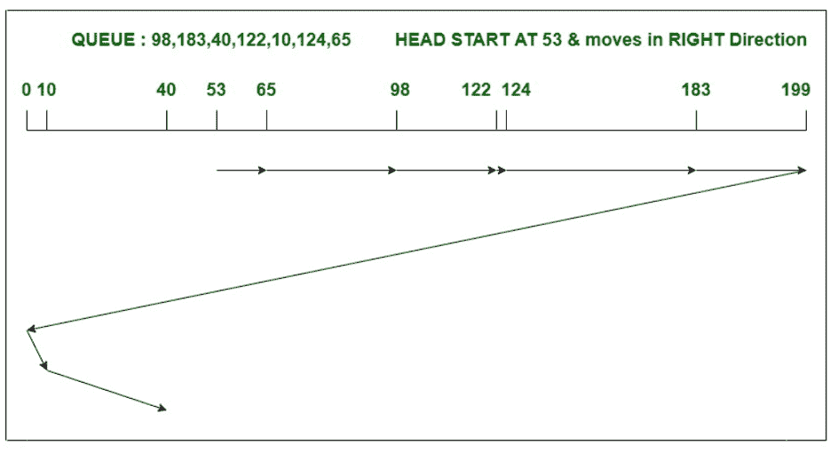

# 【FCFS 和 C-SCAN 磁盘调度算法的区别

> 原文:[https://www . geesforgeks . org/difference-FCFS-and-c-scan-disk-scheduling-algorithm/](https://www.geeksforgeeks.org/difference-between-fcfs-and-c-scan-disk-scheduling-algorithm/)

**1。 [FCFS 磁盘调度算法](https://www.geeksforgeeks.org/fcfs-disk-scheduling-algorithms/) :**
FCFS 代表先到先得，该算法按照任务到达磁盘队列的顺序来执行任务。它是最简单易懂的磁盘调度算法。在这种情况下，头或指针向任务到达的方向移动，并一直移动到所有请求都被处理完。然而，FCFS 算法对即将到来的请求有更公平的处理策略。

**示例–**
考虑一个具有 200 个磁道(0-199 个)的磁盘，该磁盘队列具有如下顺序的输入/输出请求:

```
98, 183, 40, 122, 10, 124, 65
```

读写磁头的当前磁头位置是 53。使用 FCFS 算法计算读/写磁头的磁道移动总数。


头部运动总数，

```
= (98-53)+(183-98)+(183-40)
               +(122-40)+(122-10)+(124-10)+(124-65)
= 640

```

**2。 [C-SCAN 磁盘调度算法](https://www.geeksforgeeks.org/c-scan-disk-scheduling-algorithm/) :**
C-SCAN 算法，又称循环电梯算法，是 [SCAN 算法](https://www.geeksforgeeks.org/scan-elevator-disk-scheduling-algorithms/)的修改版。在这个算法中，头指针从磁盘的一端开始，向另一端移动，服务于其间的所有请求。到达另一端后，头部反转方向，前往起点。然后，它以与之前相同的方向满足剩余的请求。C-SCAN 是最好的磁盘调度算法之一。

**示例–**
考虑一个具有 200 个磁道(0-199 个)的磁盘，该磁盘队列具有如下顺序的输入/输出请求:

```
98, 183, 40, 122, 10, 124, 65
```

读/写磁头的当前磁头位置是 53，并将向右移动。使用 C-SCAN 算法计算读/写磁头的磁道移动总数。



头部运动总数，

```
= (65-53)+(98-65)+(122-98)+(124-122)+(183-124)
               +(199-183)+(199-0)+(10-0)+(40-10)
= 395

```

**FCFS 和 C-SCAN 磁盘调度算法的区别:**

<center>

| 没有。 | 磁盘调度算法 | 扫描磁盘调度算法 |
| one | FCFS 在寻道运动中效率低下。 | 而 C-SCAN 在寻道运动中非常有效。 |
| Two | FCFS 导致平均等待时间和响应时间更长。 | 但是 C-SCAN 导致平均响应时间和等待时间更少。 |
| three | 在上面的 FCFS 示例中，头部从 53 开始，按照请求到达磁盘队列的顺序为其提供服务。 | 在上面的 C-SCAN 算法示例中，头部从 53 开始移动，以正确的方向服务所有请求，直到到达另一端。然后它跳到另一端，只向正确的方向提供剩余的请求。 |
| four | 在 FCFS 算法中，吞吐量减少。 | 这里是吞吐量的增量。 |
| five | FCFS 不会对任何请求造成饥饿，但是请求可以体验护卫效果。 | 在 C-SCAN 算法中，请求既不会出现饥饿，也不会出现护卫效应。 |
| six | FCFS 算法易于理解和实现。 | C-SCAN 算法的性能远优于 FCFS 算法。 |

</center>