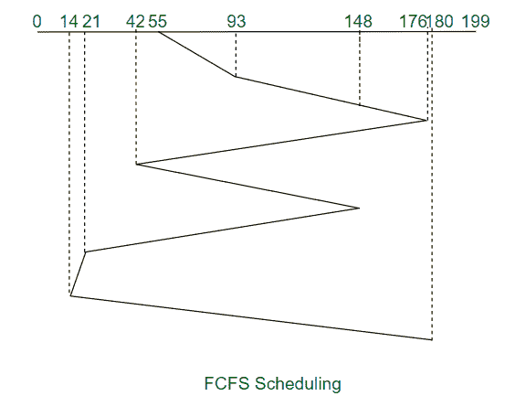
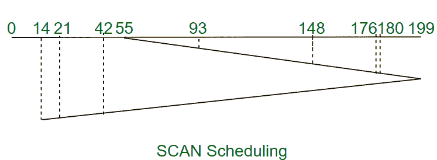

# 【FCFS 和 SCAN 磁盘调度算法的区别

> 原文:[https://www . geesforgeks . org/FCFS 和扫描磁盘调度算法之间的差异/](https://www.geeksforgeeks.org/difference-between-fcfs-and-scan-disk-scheduling-algorithms/)

**[FCFS 磁盘调度算法](https://www.geeksforgeeks.org/fcfs-disk-scheduling-algorithms/) :**
顾名思义，FCFS 调度算法按照请求到达磁盘队列的顺序处理请求。即使时间表中较高优先级的请求稍后到达，FCFS 也会按照它们到达的顺序处理请求，因此我们可以说 FCFS 有一个公平的策略。

**示例:**
考虑一个有 200 个磁道(0-199)的磁盘，磁盘队列中有 I/O 请求，顺序如下:93、176、42、148、21、14、180。读写磁头的当前磁头位置是 55。使用 FCFS 计算读/写磁头的磁道移动总数。



总寻道时间，

```
= (93-55) + (176-93) + (176-42) 
               + (148-42) + (148-21) 
               + (21-14) + (180-14) 
= 661  
```

**[SCAN 磁盘调度算法](https://www.geeksforgeeks.org/scan-elevator-disk-scheduling-algorithms/) :**
顾名思义，SCAN 算法以来回方式扫描磁盘的所有磁道，这样它将首先处理一个方向上的所有请求，直到到达该方向上的最后一个磁道，然后反转方向，开始处理遇到的请求。该算法也被称为**电梯算法**，因为它像电梯一样工作，通过在一个方向上连续移动来服务请求，然后反转方向。

**示例:**
考虑一个有 200 个磁道(0-199)的磁盘，磁盘队列中有 I/O 请求，顺序如下:93、176、42、148、21、14、180。读写磁头的当前磁头位置是 55。使用扫描计算读/写磁头的磁道移动总数。



总寻道时间，

```
= (199-55) + (199-14) 
= 329  
```

现在，让我们看看 FCFS 和 SCAN 磁盘调度算法之间的区别:

<center>

| 不，先生。 | 磁盘调度算法 | 扫描磁盘调度算法 |
| --- | --- | --- |
| 1. | FCFS 调度算法将按照请求到达磁盘队列的顺序来处理请求。 | 扫描调度算法将首先在一个方向上处理请求，直到到达磁盘末端，然后磁盘臂反转方向，开始以相反的顺序处理请求。 |
| 2. | FCFS 算法有一个公平的策略，因为请求是按照计划处理的，所以无限延期的机会较少。 | 可能发生的情况是，请求的位置刚刚被磁盘臂访问过，因此请求将有很长的等待时间。 |
| 3. | 在所有磁盘调度算法中，FCFS 算法的吞吐量最低。 | SCAN 算法比 FCFS 调度算法具有更好的吞吐量。 |
| 4. | FCFS 算法的平均寻道时间是所有磁盘调度算法中最高的，因为它没有试图优化寻道时间。 | 与 FCFS 调度算法相比，SCAN 算法的平均寻道时间要低得多。 |

</center>