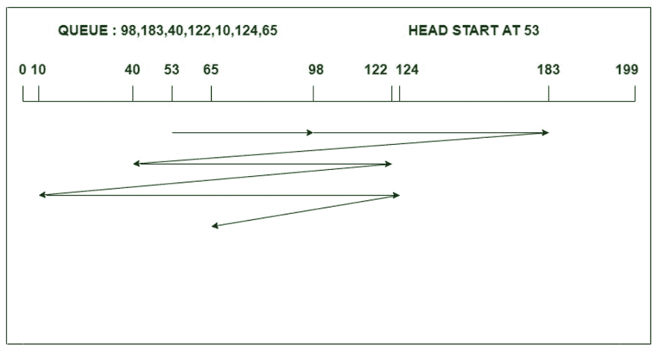

# 【FCFS 和 SSTF 磁盘调度算法的区别

> 原文:[https://www . geesforgeks . org/difference-FCFS-and-sstf-disk-scheduling-algorithm/](https://www.geeksforgeeks.org/difference-between-fcfs-and-sstf-disk-scheduling-algorithm/)

先决条件–[磁盘调度算法](https://www.geeksforgeeks.org/disk-scheduling-algorithms/)
**1。 [FCFS 磁盘调度算法](https://www.geeksforgeeks.org/fcfs-disk-scheduling-algorithms/) :**
先到先得，顾名思义这个算法按照任务到达磁盘队列的顺序来执行任务。它是最简单易懂的磁盘调度算法。在这种情况下，头或指针向任务到达的方向移动，并一直移动到所有请求都被处理完。FCFS 提供了更多的平均等待时间和响应时间。然而，FCFS 算法对即将到来的请求有更公平的处理策略。

**示例:**
考虑一个有 200 个磁道(0-199 个)的磁盘，该磁盘队列有如下顺序的输入/输出请求:

```
98, 183, 40, 122, 10, 124, 65 
```

读写磁头的当前磁头位置是 53。使用 FCFS 算法计算读/写磁头的磁道移动总数。



头部运动总数，

```
= (98-53)+(183-98)+(183-40)+(122-40)+(122-10)+(124-10)+(124-65)
= 640
```

**2。 [SSTF 磁盘调度算法](https://www.geeksforgeeks.org/program-for-sstf-disk-scheduling-algorithm/) :**
SSTF 代表最短寻道时间优先，顾名思义，它服务于最接近磁头或指针当前位置的请求。在这个算法中，头部指针的方向非常重要。如果不知何故，我们遇到了请求之间的联系，那么负责人将按照其正在进行的方向提供请求。与 FCFS 相比，SSTF 算法在寻道时间上非常有效。

**示例:**
考虑一个有 200 个磁道(0-199 个)的磁盘，该磁盘队列有如下顺序的输入/输出请求:

```
98, 183, 40, 122, 10, 124, 65 
```

读/写磁头的当前磁头位置是 53，并将向右移动。使用 SSTF 算法计算读/写磁头的磁道移动总数。


头部运动总数，

```
= (65-53)+(65-40)+(40-10)+(98-10)+(122-98)+(124-122)+(183-124)
= 240
```

**FCFS 和 SSTF 磁盘调度算法的区别:**

<center>

|  | 调度算法 | SSTF 调度算法 |
| 1. | FCFS 在寻道运动中效率不高。 | SSTF 在寻找运动方面非常有效。 |
| 2. | 这导致总寻道时间增加。 | 与 FCFS 相比，它减少了总寻道时间。 |
| 3. | 它提供了更多的平均等待时间和响应时间。 | 该算法提供更少的平均响应时间和等待时间。 |
| 4. | 在这个算法中，头部的方向并不重要，我们可以在上面的例子中清楚地看到。 | 但是这里头的方向起着重要的作用，为了打破请求之间的联系，上面的例子就是一个证明。 |
| 5. | 该算法易于理解和实现。 | 在这里，找出最接近的请求是一个开销。 |
| 6. | FCFS 不会对任何请求造成饥饿(但可能会受到护卫队效应的影响。). | 在这里，远离头部的请求将遭受饥饿。 |
| 7. | 在 FCFS 算法中，吞吐量减少。 | 在 SSTF，吞吐量增加了。 |

</center>