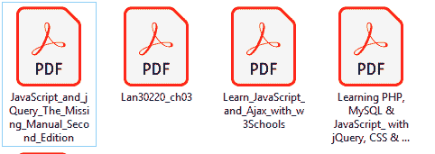
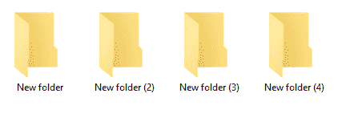

# 文件和文件夹的区别

> 原文:[https://www . geesforgeks . org/文件和文件夹的区别/](https://www.geeksforgeeks.org/difference-between-file-and-folder/)

**文件:**
文件被定义为存储在二级存储器中的一组相关数据或信息。文件是数据文件或程序文件，其中前者包含字母数字、数字或二进制形式的数据和信息，后者包含程序代码，也可以执行，是程序文件。

**例:**

**文件夹:**
用来包含很多其他的文件夹和文件。我们可以有任意数量的文件夹，每个文件夹可以有不同的/大量的条目，这取决于所创建的文件，其中每个文件在父文件夹中都有一个位置。

**例:**

**文件和文件夹的区别:**

| 没有。 | 比较 | 文件 | 文件夹 |
| 1. | 扩展ˌ扩张 | 文件可以有扩展名。 | 文件夹没有任何扩展名。 |
| 2. | 组织 | 串行、顺序、索引顺序和直接文件组织。 | 每个用户一个目录，每个用户组织多个目录。 |
| 3. | 包含其他相同的实体 | 号码 | 是的。 |
| 4. | 基础 | 数据收集。 | 存放一组相关文件和文件夹的地方。 |
| 5. | 空间消耗 | 文件有特定的大小。 | 文件夹不会占用内存空间。 |
| 6. | 性能 | 它具有名称、扩展名、日期、时间、长度和保护属性。 | 它具有名称、日期、时间和保护属性。 |
| 7. | 创造之后 | 创建后，我们可以打开、保存、重命名、打印、发送电子邮件和修改文件内容。 | 创建后，我们可以移动，重命名和删除文件夹。 |
| 8. | 网络共享 | 我们不能在网络上共享文件。 | 我们可以在网络上共享文件夹。 |

