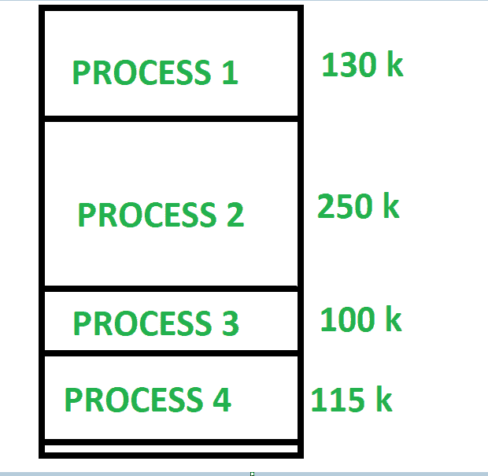

# 固定分区和可变分区的区别

> 原文:[https://www . geesforgeks . org/固定分区和可变分区的区别/](https://www.geeksforgeeks.org/difference-between-fixed-partitioning-and-variable-partitioning/)

**1。[固定分区](https://www.geeksforgeeks.org/fixed-or-static-partitioning-in-operating-system/) :**
具有固定分区的多程序设计是一种连续内存管理技术，其中主内存被划分为大小相等或不等的固定分区。每当我们必须分配一个进程内存时，就会找到一个足够大的空闲分区来容纳这个进程。然后将内存分配给进程。如果没有可用的空间，那么进程在队列中等待分配内存。它是最古老的内存管理技术之一，易于实现。

**2。[变量分区](https://www.geeksforgeeks.org/variable-or-dynamic-partitioning-in-operating-system/) :**
采用变量分区的多程序设计是一种连续内存管理技术，其中主内存不被划分为分区，进程被分配一大块足够大的空闲内存。剩下的空间被认为是可以被其他进程进一步使用的自由空间。它还提供了压缩的概念。在压缩过程中，空闲空间和未分配给进程的空间被合并，形成单个大内存空间。

**固定分区和可变分区的区别:**

| 没有 | 固定分区 | 可变分区 |
| --- | --- | --- |
| 1. | 在具有固定分区的多程序设计中，主存被分成固定大小的分区。 | 在具有可变分区的多程序设计中，主存没有被分成固定大小的分区。 |
| 2. | 一个分区中只能放置一个进程。 | 在变量分区中，进程被分配了一大块空闲内存。 |
| 3. | 它没有有效地利用主存。 | 它有效地利用了主存。 |
| 4. | 存在内部碎片和外部碎片。 | 有外部碎片。 |
| 5. | 多编程的程度比较少。 | 多编程程度较高。 |
| 6. | 更容易实现。 | 它不太容易实现。 |
| 7. | 过程的大小是有限制的。 | 过程的大小没有限制。 |

