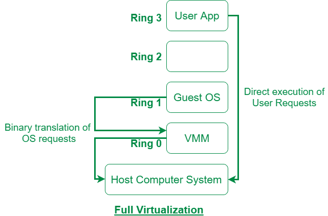
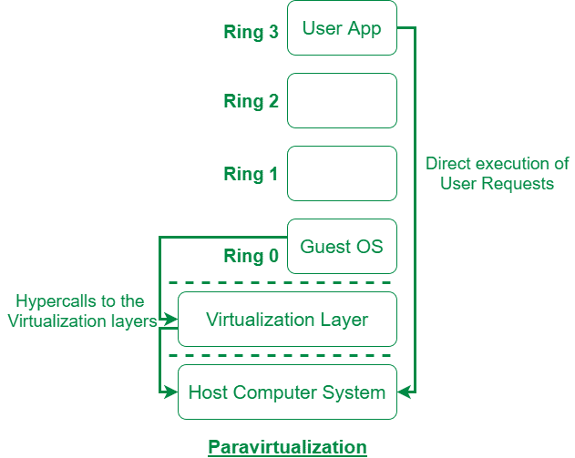

# 完全虚拟化和半虚拟化的区别

> 原文:[https://www . geesforgeks . org/完全虚拟化和半虚拟化的区别/](https://www.geeksforgeeks.org/difference-between-full-virtualization-and-paravirtualization/)

**1。完全虚拟化:**
完全虚拟化是由 IBM 在 1966 年推出的。它是服务器虚拟化的第一个软件解决方案，使用二进制翻译和直接方法技术。在完全虚拟化中，来宾操作系统被虚拟机与虚拟化层和硬件完全隔离。微软和 Parallels 系统就是完全虚拟化的例子。

**2。半虚拟化:**
半虚拟化是 CPU 虚拟化的一个类别，它使用操作的超调用在编译时处理指令。在半虚拟化中，来宾操作系统不是完全隔离的，但它被虚拟机从虚拟化层和硬件中部分隔离。VMware 和 Xen 是半虚拟化的一些例子。

完全虚拟化和半虚拟化的区别如下:

| 没有。 | 完全虚拟化 | 半虚拟化 |
| --- | --- | --- |
| 1. | 在完全虚拟化中，虚拟机允许以完全隔离的方式运行未经修改的操作系统来执行指令。 | 在半虚拟化中，虚拟机没有实现操作系统的完全隔离，而是提供了一个不同的应用编程接口，当操作系统发生变化时，可以使用这个接口。 |
| 2. | 完全虚拟化不太安全。 | 而半虚拟化比完全虚拟化更安全。 |
| 3. | 完全虚拟化使用二进制翻译和直接方法作为操作技术。 | 而半虚拟化在编译时使用超调用进行操作。 |
| 4. | 在运行中，完全虚拟化比半虚拟化慢。 | 与完全虚拟化相比，半虚拟化的运行速度更快。 |
| 5. | 完全虚拟化更加便携和兼容。 | 半虚拟化的可移植性和兼容性较差。 |
| 6. | 完全虚拟化的例子有微软和 Parallels 系统。 | 半虚拟化的例子有 VMware 和 Xen。 |

