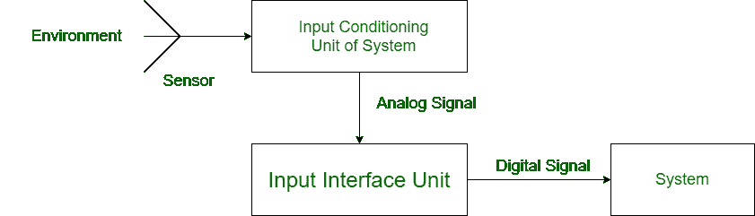
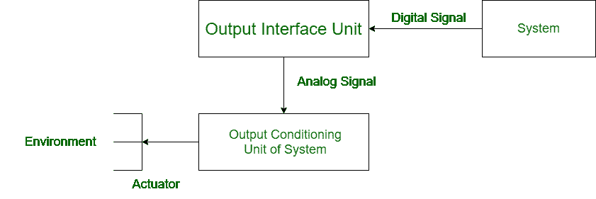

# 输入输出接口单元的区别

> 原文:[https://www . geesforgeks . org/输入输出接口单元差异/](https://www.geeksforgeeks.org/difference-between-input-and-output-interface-unit/)

计算机系统对数字信号进行计算，但用户向计算机系统发送模拟信号。接口单元基本上用于计算机系统中信号的转换，以便在环境和计算机系统之间建立相互通信和理解。接口单元有两种类型:

**1。输入接口单元:**
输入接口单元是计算机系统中用于将模拟信号转换成数字信号的一种接口单元。它基本上将用户信号转换成计算机系统使用的信号。

**2。输出接口单元:**
输出接口单元也是计算机系统中用于将数字信号转换成模拟信号的一种接口单元。它将计算机系统使用的计算信号转换成用户信号。

**输入输出接口单元差异:**

| 输入接口单元 | 输出接口单元 |
| --- | --- |
| 它用于将模拟信号转换为数字信号。 | 它用于将数字信号转换为模拟信号。 |
| 它从输入调节单元获取输入。 | 它在计算后从系统获取输入。 |
| 它将输出提供给系统进行计算。 | 它向输出调节单元提供输出。 |
| 在某些系统中，它与传感器直接相关。 | 在某些系统中，它直接与执行器相关联。 |
| 这里的输入是模拟信号。 | 这里输入的是数字信号。 |
| 这里输出的是数字信号。 | 这里的输出是模拟信号。 |
| 它是用户和系统之间的媒介，以便系统能够理解用户信号。 | 它也是用户和系统之间的中介，帮助用户理解系统信号。 |

