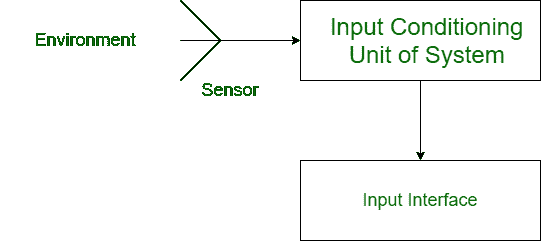
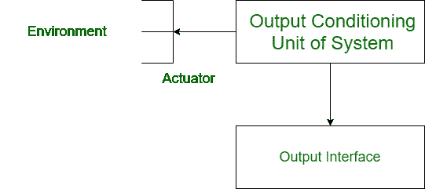

# 输入调节单元和输出调节单元之间的差异

> 原文:[https://www . geesforgeks . org/输入-调节-输出-调节-单位之差/](https://www.geeksforgeeks.org/difference-between-input-conditioning-and-output-conditioning-unit/)

当从用户向计算机系统传输信号时，反之亦然，电信号的频率范围、电压放大或电压电平可能会发生变化。为了满足关于电信号的水平和这样的属性，进行不同的调节。

系统中主要有两个调节单元:

**1。输入调节单元:**
输入调节单元是改变来自传感器/环境并去往系统输入接口单元的电信号特性的调节。可能会有一些问题，比如输入电信号的电压在毫伏范围内，而系统只接受伏范围。在这种情况下，使用输入调节装置。

**2。输出调节单元:**
输出调节单元是改变来自系统和去往环境/致动器的电信号的特性的调节。可能会出现输出电信号的频率范围与执行器的量程不匹配等问题。在这种情况下，使用输出调节装置。

**输入和输出调节单元之间的差异:**

| 输入调节装置 | 输出调节装置 |
| --- | --- |
| 它用于输入信号特性的转换。 | 它用于输出信号特性的转换。 |
| 它接受来自传感器的输入。 | 它从输出接口单元获取输入。 |
| 它向输入接口单元提供输出。 | 它向执行器提供输出。 |
| 它是传感器和输入接口之间的媒介，因此可以缩放信号。 | 它还是输出接口和致动器之间的媒介，因此可以缩放信号。 |
| 它将低频信号转换成高频信号。 | 它将高量程频率信号转换为低量程频率信号。 |
| 示例:将光伏电池的信号从毫伏转换为伏 | 示例:信号频率的转换，以方便用户。 |

