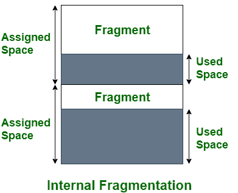
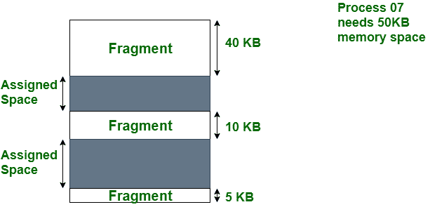

# 内部碎片和外部碎片的区别

> 原文:[https://www . geesforgeks . org/内外碎片化的区别/](https://www.geeksforgeeks.org/difference-between-internal-and-external-fragmentation/)

操作系统中有两种类型的碎片，即内部碎片和外部碎片。

**1。内部碎片:**
当内存被分割成挂载大小的块时，就会发生内部碎片。每当为内存请求一个方法时，装入大小的块就被分配给该方法。万一分配给该方法的内存比请求的内存大一些，那么分配的内存和请求的内存之间的区别就是内部碎片。

**内部碎裂**

上图清楚地显示了内部碎片，因为分配的内存和所需的空间或内存之间的差异被称为内部碎片。

**2。外部碎片:**
当内存中有足够的区域来满足方法的内存请求时，就会发生外部碎片。但是，无法满足进程的内存请求，因为提供的内存不连续。无论您应用第一种还是最佳内存分配策略，都会导致外部碎片。

**外部碎片**

在上图中，我们可以看到，有足够的空间(55 KB)来运行一个进程-07(需要 50 KB)，但是内存(片段)不是连续的。这里，我们使用压缩、分页或分段来使用空闲空间来运行进程。

### **内部碎片和外部碎片的区别**

<figure class="table">

| S.NO | 内部分裂 | 外部碎片 |
| --- | --- | --- |
| 1. | 在内部碎片固定大小的内存中，指定要处理的块的平方度量。 | 在外部碎片中，指定给该方法的可变大小内存块的平方度量。 |
| 2. | 当方法或进程大于内存时，就会发生内部碎片。 | 当方法或进程被移除时，会发生外部碎片。 |
| 3. | 内部碎片的解决方案是最合适的区块。 | 外部碎片的解决方案是压缩和分页。 |
| 4. | 当内存被划分为固定大小的分区时，就会发生内部碎片。 | 当根据进程的大小将内存划分为大小可变的分区时，就会发生外部碎片。 |
| 5. | 分配的内存与所需空间或内存之间的差异称为内部碎片。 | 非连续内存碎片之间形成的未使用空间太小，无法为新进程提供服务，这称为外部碎片。 |
| 6. | 分页和固定分区会产生内部碎片。 | 分段和动态分区会产生外部碎片。 |
| 7. | 它发生在将一个进程分配给一个大于该进程需求的分区时。剩余空间会导致系统性能下降。 | 当一个进程被分配到一个更大的分区时，就会发生这种情况，该分区与所需的内存空间完全相同。 |

</figure>