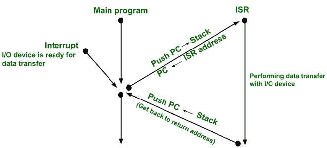

# ISR 和函数调用的区别

> 原文:[https://www . geesforgeks . org/ISR 和函数调用之间的区别/](https://www.geeksforgeeks.org/difference-between-isr-and-function-call/)

**中断:**

*   中断是微处理器工作过程中出现的一种特殊情况。
*   微处理器通过执行一个叫做中断服务程序的子程序来服务中断。
*   中断可以通过外部信号(即微处理器的外部引脚)或软件中断或程序产生的条件提供给处理器。

**中断处理机制:**

*   当中断发生时，处理器首先完成当前指令。
*   然后，它会暂停当前程序并执行 ISR。
*   为此，它将 PC(下一条指令的地址)的值推入堆栈。
*   现在，它将 ISR 地址加载到 PC 中，并继续执行 ISR。
*   在 ISR 结束时，它会从堆栈中弹出返回地址，并将其加载回 PC。
*   这就是处理器如何返回到程序中的下一条指令。

**中断处理机制**

**示例 1–**
通过中断驱动输入/输出进行输入/输出传输

*   如果一个输入输出设备想与处理器进行数据传输，必须给处理器一个中断。
*   中断是使处理器执行中断服务程序的条件。
*   在 ISR 中，处理器将与输入/输出设备进行数据传输。
*   每当设备想要传输数据时，它都会中断处理器。

**例 2–**
按键盘键中断请求，

*   不是处理器一直检查是否按下了某个键，而是键盘像我们按下某个键一样中断处理器。在键盘的 ISR(键盘驱动软件的一部分)中，处理器将从键盘读取数据。

**功能:**

*   子程序(过程/子程序)是程序重复需要的一组指令。它作为一个子程序存储，由主程序从几个地方调用。
*   在 8086 处理器的情况下，子程序由 CALL 指令或调用，控制由 RET 指令返回。
*   它减少了程序的大小。
*   执行缓慢，因为在堆栈中推送和弹出返回地址会浪费时间。
*   这取决于堆栈。

**ISR 与功能调用的区别:**

<figure class="table">

| 

Sl。号码

 | 

中断服务程序

 | 

函数调用

 |
| --- | --- | --- |
| 1. | 中断通常由内部(即被零除、寄存器溢出等)启动。)或外部信号(即微处理器的外部引脚)而不是指令的执行(即软件中断)。在堆栈中存储程序的当前状态(即 PC、PSW 的值)后，执行 ISR。ISR 根据中断的设备或程序员编写的指令(在软件中断的情况下)执行不同类型的任务。 | 函数调用是通过执行指令来调用的，这些指令执行特定的任务，并且还减小了程序的大小。 |
| 2. | 

*   The ISR address is written into the interrupt vector table.
*   **For example,** –
    In the case of 8086, the first 1KB of memory, with the address of 00000 H … 003FF H, is reserved for IVT.
*   ISR address of each interrupt is fixed.

 | 子程序的地址写在主程序代码中的指令中。 |
| 3.

 | ISR 的地址由硬件决定。 | 子程序的地址写在主程序内部。 |
| 4. | ISR 用于所有通用任务。
**例如–**
如果打印机中的纸张不存在，则由执行 ISR 的打印机产生中断(即显示屏上的错误信息)。 | 针对程序特定任务(即针对应用程序特定任务)进行函数调用。 |
| 5\.              | 因此，当当前程序执行期间发生中断时，在当前指令执行之后，处理器执行中断服务。ISR 执行后，处理器必须恢复到中断发生前的状态。为此，存储了个人计算机的内容、P 寄存器的内容和一些状态条件的内容。
微处理器中所有状态位条件的集合称为 PSW(程序状态字)。在中断周期中，PC 和 PSW 的内容被推送到堆栈上。特定中断的分支地址随后被传递给 PC 机，一个新的 PSW 被载入状态寄存器。ISR 中的最后一条指令是中断指令的返回。执行此指令时，旧的 PSW 和返回地址会从堆栈中弹出。 | 这里，堆栈上只存储一台 PC，以获取主程序中下一条指令的地址。子程序有必要访问调用子程序的数据，并将结果返回给该子程序。因此，子程序参数和数据联动完成。这可以通过

*   交流寄存器可用于单个输入参数和单个输出参数。在具有多个处理器寄存器的计算机中，更多的参数可以通过这种方式传递。
*   将数据传递给子程序的另一种方法是通过内存。

 |

</figure>