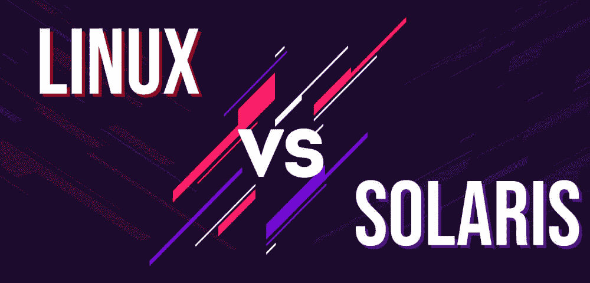

# 【Linux 和 Solaris 的区别

> 原文:[https://www . geesforgeks . org/Linux 和 solaris 的区别/](https://www.geeksforgeeks.org/difference-between-linux-and-solaris/)

**Linux** 操作系统由 Linus Torvalds 于 1991 年开发。Linux 操作系统以其开源支持和高灵活性而闻名。多年来，Linux 操作系统因其低依赖性、高模块化和广泛的发行版而在行业中非常受欢迎。Linux 操作系统因其内核能力而被使用，其体系结构也由两层组成，称为内核层和用户层。

Solaris 操作系统是由太阳微系统公司在 1992 年开发的。Solaris 操作系统最初是作为开源软件发布的，但后来在甲骨文收购太阳微系统公司并将其重新命名为甲骨文 Solaris 后，它被许可发布。Oracle Solaris 用于服务管理设施，因为它易于更新并提供最佳性能。

### Linux 和 Solaris 的区别

| 的基础 | Linux 操作系统 | Solaris |
| --- | --- | --- |
| 开发人 | 它是由莱纳斯·托瓦尔兹开发的。 | 它是由太阳微系统公司开发的。 |
| 用于 | Linux 用于手机和嵌入式平板电脑。 | Solaris 用于服务管理。 |
| 与...一起发展 | Linux 是用 C 语言开发的。 | Solaris 是使用 C 和 C++这两种语言开发的。 |
| 吞吐量 | Linux 有不错的吞吐量。 | Solaris 具有出色的吞吐量。 |
| 需要许可证 | Linux 是一个开源操作系统，没有这样的要求。 | Solaris 是在甲骨文购买 Sun 微系统后获得许可的。 |
| 装置 | 通过 Kickstart 安装，Linux 安装非常简单。 | Solaris 安装要求在安装操作系统之前自动安装。 |
| 分布 | Linux 根据用途有多种发行版。 | Solaris 没有这样的发行版。 |
| 支持 | Linux 的定期更新得到了广泛的支持。 | Solaris 有批量发布的软件更新。 |