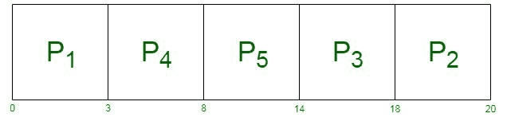
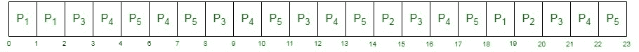

# LJF 和 LRJF CPU 调度算法的区别

> 原文:[https://www . geesforgeks . org/difference-ljf-and-lrjf-CPU-调度-算法/](https://www.geeksforgeeks.org/difference-between-ljf-and-lrjf-cpu-scheduling-algorithms/)

**1。[最长作业优先(LJF)](https://www.geeksforgeeks.org/longest-job-first-ljf-cpu-scheduling-algorithm/) :**
It CPU 调度算法，其中具有最大突发线的进程首先被执行。一旦进程进入就绪队列，进程只有在执行完成后才退出，因此它是非抢占式进程。如果进程的突发时间相同，则选择总体时间最短的作业。这种 CPU 调度算法导致系统的低吞吐量。

| 过程 | 在(某时间或时刻);在(学习或工作地点);在(某处) | 英国电信公司 |
| --- | --- | --- |
| one | Zero | three |
| Two | one | Two |
| three | Two | four |
| four | three | five |
| five | four | six |

**2。[最长剩余作业优先(LRJF)](https://www.geeksforgeeks.org/longest-remaining-time-first-lrtf-cpu-scheduling-algorithm/) :**
是最长作业优先 CPU 调度算法的抢先版。每秒选择一次进程突发时间，然后选择最长的作业。如果进程的突发时间相同，则选择到达时间总体较低的作业。

由于同时检查进程的剩余突发时间，它遭受饥饿。它也被称为“最长剩余时间优先”算法。

| 过程 | 在(某时间或时刻);在(学习或工作地点);在(某处) | 英国电信公司 |
| --- | --- | --- |
| one | Zero | three |
| Two | one | Two |
| three | Two | four |
| four | three | five |
| five | four | six |

**LJF 和 LRJF CPU 调度算法的区别:**

| LJF | LRJF |
| --- | --- |
| 不优先 | 先发制人的 |
| 它饱受饥饿之苦 | 它也饱受饥饿之苦 |
| 等待时间很长 | 等待时间没有那么长，进程在一段时间后有机会执行。 |
| 切换上下文较少，因为一旦进入运行状态的进程就会被完全执行。 | 切换上下文更重要，因为流程会不断地被检查执行情况。 |
| 这些进程仅根据其 CPU 时间和到达时间来执行，不会增加 CPU 过载。 | 这些进程反复检查空闲的中央处理器，从而增加了过载。 |
| 在最长的作业持续之前，任何进程都无法完成其执行。 | 这些进程可以在最长的进程之前完成执行。 |

