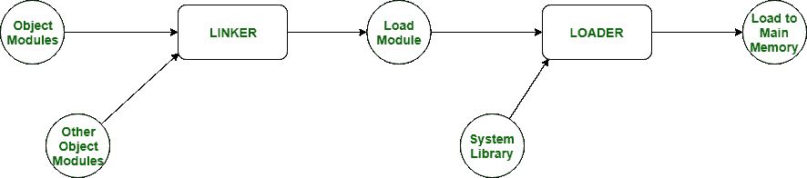

# 加载和链接的区别

> 原文:[https://www . geesforgeks . org/加载和链接的区别/](https://www.geeksforgeeks.org/difference-between-loading-and-linking/)

[**链接**](https://www.geeksforgeeks.org/compiler-design-linker/) 和**加载**是在程序执行中起重要作用的实用程序。链接接收汇编程序生成的目标代码，并将它们组合起来生成可执行模块。另一方面，加载将这个可执行模块加载到主存储器中执行。

**加载:**
把程序从二级内存带到主存叫做加载。

**链接:**
在程序的所有模块或所有功能之间建立链接，以继续程序的执行，称为链接。

**链接和加载的区别:**

1.  链接和加载的主要区别在于，链接生成程序的可执行文件，而加载将通过链接获得的可执行文件加载到主内存中执行。
2.  链接接收由汇编程序生成的程序的目标模块。但是，加载会接收链接生成的可执行模块。
3.  链接将程序的所有目标模块组合起来生成可执行模块。它还将目标模块中的库函数链接到高级编程语言的内置库。另一方面，加载将空间分配给主内存中的可执行模块。

**加载和链接进一步分为两种类型:**

<figure class="table">

| 静态 | 动态的 |
| --- | --- |
| 在程序开始执行之前将整个程序加载到主内存中称为静态加载。 | 按需将程序加载到主内存中称为动态加载。 |
| 内存利用率低，因为无论是否需要，整个程序都被放入主内存。 | 内存的有效利用。 |
| 程序执行会更快。 | 程序执行将会变慢。 |
| 静态链接程序每次被加载到内存中执行时都需要恒定的加载时间。 | 操作系统在运行时执行动态链接。 |
| 如果使用静态加载，则相应地应用静态链接。 | 如果使用动态加载，则相应地应用动态链接。 |
| 静态链接由称为链接器的程序执行，作为编译程序的最后一步。链接器也被称为链接编辑器。 | 在动态链接中，情况并非如此，单独的共享模块可以被更新和重新编译。这是动态链接提供的最大优势之一。 |
| 在静态链接中，如果任何外部程序发生了变化，那么它们必须重新编译并重新链接，否则这些变化不会反映在现有的可执行文件中。 | 在动态链接中，如果共享库代码已经存在于内存中，加载时间可能会减少。 |

</figure>