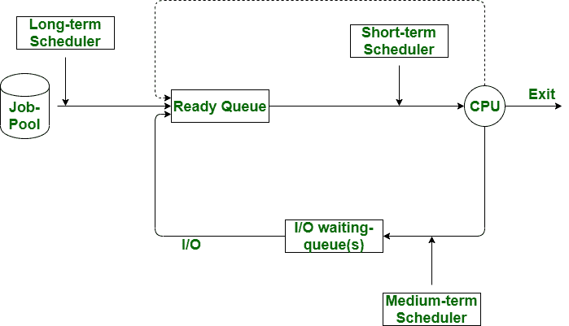

# 中长期调度器的区别

> 原文:[https://www . geesforgeks . org/长期和中期调度程序之间的差异/](https://www.geeksforgeeks.org/difference-between-long-term-and-medium-term-scheduler/)

先决条件–[进程调度器](https://www.geeksforgeeks.org/process-schedulers-in-operating-system/)
**长期调度器:**
长期调度器称为作业调度器。长期调度程序控制在系统中选择用于处理的程序。在这种情况下，程序在队列中被发现，因此根据需要选择最佳的一个作业，它从作业池中选择进程，这些进程被加载到内存中以便执行。它限制了多重编程的程度。

**中期调度器:**
中期调度器被称为进程交换调度器，因为它是交换的一部分。通过这个调度程序，进程从内存中移除。中期调度降低了多程序的程度。在这个调度程序中，如果一个进程请求输入/输出，它可以被挂起，并且它不能在完成挂起的进程方面取得任何进展。在这种情况下，为了从内存中删除该方法并为其他进程腾出空间，挂起的进程被移动到辅助存储中。这个过程被称为交换，因此这个过程被称为被换出或展开。交换对于增强流程组合也是必要的。

让我们看看长期调度程序和中期调度程序的区别:

| S.NO | 长期调度程序 | 中期调度程序 |
| --- | --- | --- |
| 1. | 长期调度程序被称为作业调度程序。 | 而中期调度程序被称为进程交换调度程序。 | 2. | 在长期调度程序中，从作业池中选择进程，并将这些进程加载到内存中以便执行。 | 在这种情况下，可以在内存中恢复进程，也可以执行进程。 |
| 3. | 长期调度程序可以是也可以不是分时系统的一部分。如果是，那么它是一个名义上的分时系统。 | 而中期调度总是在分时系统中。 |
| 4. | 长期调度器的速度低于中期调度器。 | 而中期调度器的速度相对高于长期调度器。 |
| 5. | 长期调度器提供了对 DOM(多编程程度)的限制。 | 而中期调度降低了 DOM(多程序设计的程度)的程度。 |

