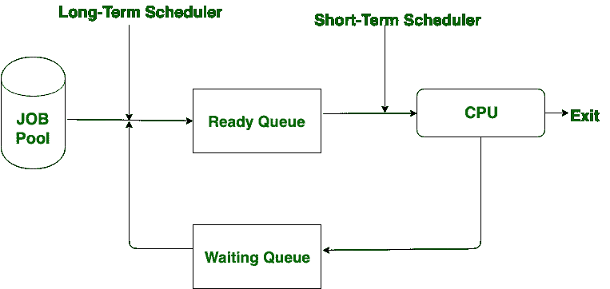

# 长期调度器和短期调度器的区别

> 原文:[https://www . geesforgeks . org/长期和短期调度程序之间的差异/](https://www.geeksforgeeks.org/difference-between-long-term-and-short-term-scheduler/)

先决条件–[进程调度器](https://www.geeksforgeeks.org/gate-notes-operating-system-scheduler/)
**长期调度器**也称为**作业调度器。**长期调度程序调节选择到系统进行处理的程序。在这种情况下，程序被设置在队列中，并且根据要求选择最佳的一个作业，并且它从作业池中获取进程。它规定了多程序设计的程度。

**短期调度器**也被称为 **CPU 调度器。**短期调度程序确保哪个程序适合或重要处理。它规定了更少的 DOM(多程序设计的程度)。

**长期调度器和短期调度器的区别:**

| S.NO | 长期调度程序 | 短期调度程序 |
| 1. | 长期计划程序从作业池中获取进程。 | 短期调度程序从就绪队列中取出进程。 |
| 2. | 长期调度程序也称为**作业调度程序**。 | 短期调度器也称为 **CPU 调度器**。 |
| 3. | 在长期调度程序中，程序被设置在队列中，并根据要求选择最佳作业。 | 在短期调度程序中，不存在这样的队列。 |
| 4. | 它规定了更多的 DOM(多程序设计的程度)。 | 它规定了较少的 DOM(多程序设计的程度)。 |
| 5. | 它控制选择到系统进行处理的程序。 | 它确保哪个程序适合或重要的处理。 |
| 6. | 速度小于短期调度器。 | 与长期调度程序相比，速度非常快。 |
| 7. | 长期调度程序将进程状态从**新建**更改为**就绪**。 | 短期调度程序将流程状态从**就绪**更改为**运行**。 |
| 8. | 分时操作系统没有长期调度程序。 | 在分时系统中可能是最小的。 |
| 9. | 它选择了一个好的进程，混合了输入输出绑定和中央处理器绑定。 | 它经常为一个中央处理器选择一个新的进程。 |

