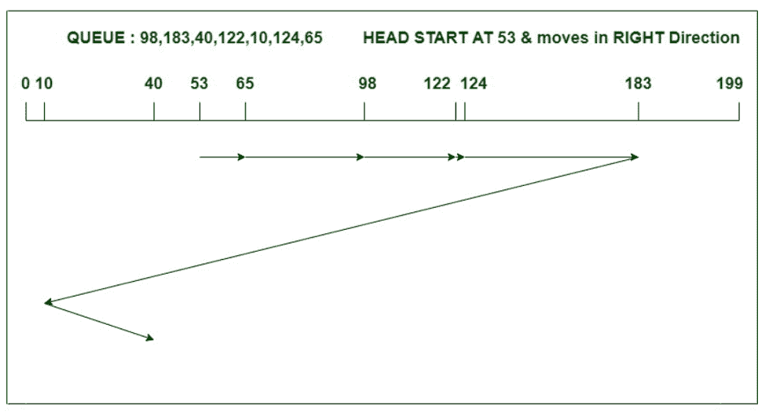

# LOOK 和 C-LOOK 磁盘调度算法的区别

> 原文:[https://www . geesforgeks . org/look-and-c-look-disk-scheduling-algorithms/](https://www.geeksforgeeks.org/difference-between-look-and-c-look-disk-scheduling-algorithms/)

**1。 [LOOK 磁盘调度算法](https://www.geeksforgeeks.org/look-disk-scheduling-algorithm/) :**
Look 算法其实是 SCAN 算法的改进版。在该算法中，磁头从磁盘一侧的第一个请求开始，通过服务其间的所有请求向另一端移动。在到达一端的最后一个请求后，头部反转方向并返回到第一个请求，服务于中间的所有请求。与扫描不同，在这种情况下，磁头不是一直到最后一个磁道，而是一直到最后一个请求，然后改变方向。

**示例–**
考虑一个具有 200 个磁道(0-199)的磁盘，该磁盘队列中的 I/O 请求顺序如下:98、183、40、122、10、124、65。读/写磁头的当前磁头位置是 53，并将向右移动。使用 LOOK 算法计算读/写磁头的磁道移动总数。


头部运动总数，

```
= (65-53)+(98-65)+(122-98)
           +(124-122)+(183-124)+(183-40)+(40-10)
= 303 
```

**2。 [C-LOOK 磁盘调度算法](https://www.geeksforgeeks.org/c-look-disk-scheduling-algorithm/) :**
C-LOOK 是 LOOK 和 SCAN 算法的修改版。在该算法中，头部从一个方向的第一个请求开始，向另一端的最后一个请求移动，服务于其间的所有请求。在一端到达最后一个请求后，头部向另一个方向跳跃，并向剩余的请求移动，然后以与之前相同的方向满足它们。与 LOOK 不同，它只在一个方向上满足请求。

**示例–**
考虑一个具有 200 个磁道(0-199)的磁盘，该磁盘队列中的 I/O 请求顺序如下:98、183、40、122、10、124、65。读/写磁头的当前磁头位置是 53，并将向右移动。使用 C-LOOK 算法计算读/写磁头的磁道移动总数。



头部运动总数，

```
= (65-53)+(98-65)+(122-98)
               +(124-122)+(183-124)+(183-10)+(40-10)
= 333 
```

**LOOK 和 C-LOOK 磁盘调度算法的区别:**

<center>

|  | 查找磁盘调度算法 | C-LOOK 调度算法 |
| 1. | 在 LOOK 中，头部可以双向服务请求。 | 在 C-LOOK 算法中，head 只能在一个方向上服务请求。 |
| 2. | 与 C-LOOK 相比，它在性能上有所落后。 | C-LOOK 算法是所有磁盘调度算法中性能最好的。 |
| 3. | 在上面的 LOOK 算法示例中，头部从 53 开始移动，以正确的方向服务所有请求，直到到达一端的最后一个请求。然后，它反转方向，并以向左的方向处理剩余的请求。 | 在 C-LOOK 算法的上述例子中，头部从 53 开始移动，以正确的方向服务所有请求，直到它到达一端的最后一个请求。然后，它跳转到剩余的请求，只向正确的方向提供服务。 |
| 4. | 这里的请求处理不如 C-LOOK 算法好。 | C-LOOK 算法比 LOOK 更能有效地处理请求。 |
| 5. | LOOK 具有更高的吞吐量，并提供低方差响应时间。 | C-LOOK 提供统一的等待时间和响应时间。 |

</center>