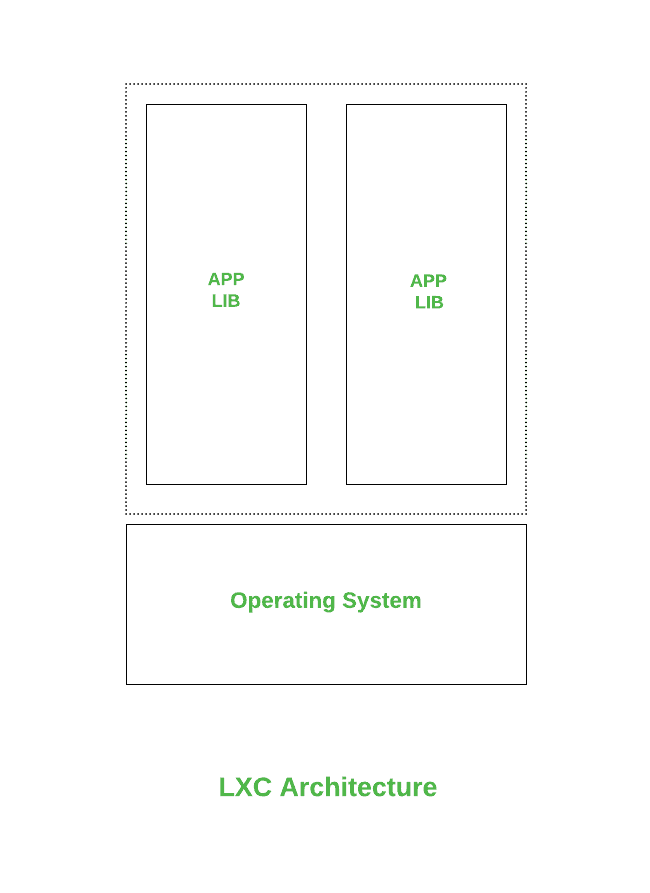
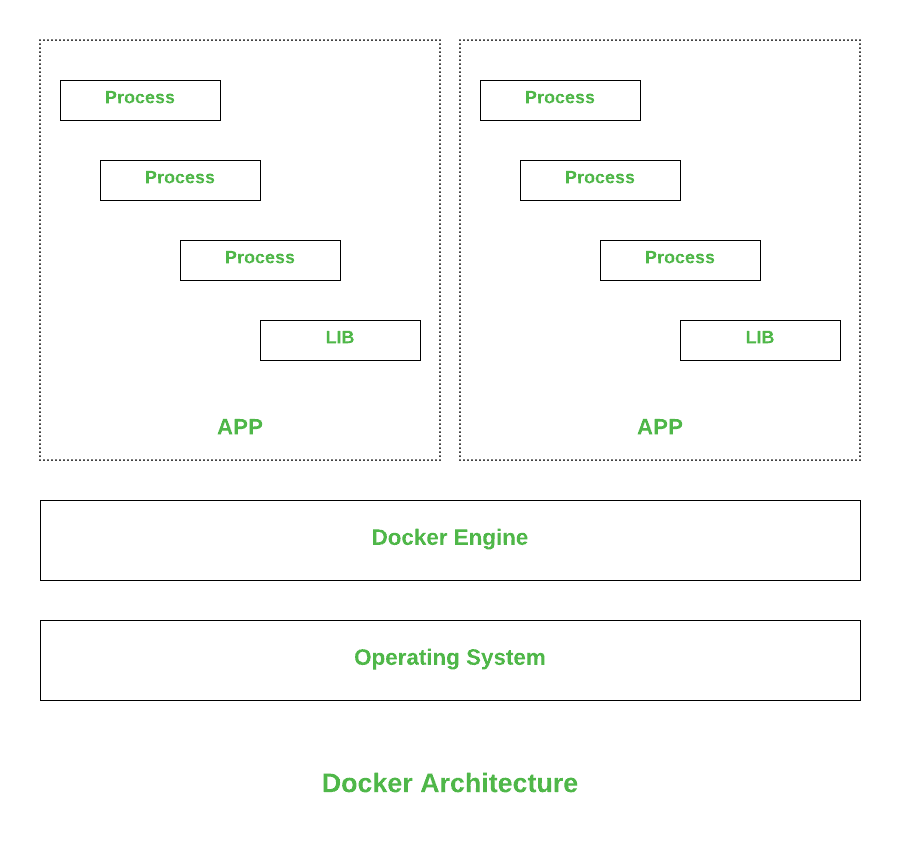

# LXC 集装箱和码头集装箱的区别

> 原文:[https://www . geeksforgeeks . org/区别-lxc-和-docker-containers/](https://www.geeksforgeeks.org/difference-between-lxc-and-docker-containers/)

**1。**[**【LXC】**](https://www.geeksforgeeks.org/linux-virtualization-linux-containers-lxc/)**:**
LXC 是 Linux Containers 的缩写，这是一种操作系统，用于通过单个 Linux 内核在受控主机上虚拟运行多个 Linux 系统。LXC 与内核的 Cgroups 捆绑在一起，为进程和网络空间提供功能，而不是创建一个完整的虚拟机，并为应用程序提供一个隔离的环境。
LXC 提供的功能:

1.  它提供内核命名空间，如 IPC、挂载、PID、网络和用户。
2.  它提供内核功能。
3.  对照组。
4.  Seccomp 配置文件

**2。**[**Docker**](https://www.geeksforgeeks.org/virtualisation-with-docker-containers/)**:**
Docker 是一个开源工具，用于在一个集中的平台上创建、部署和运行应用程序。这使得主机的操作系统能够通过容器运行具有相同 Linux 内核的应用程序，而不是创建一个完整的虚拟机。使用 docker 容器，您不需要考虑内存和磁盘空间的分配。它能够自己处理需求。
Docker 提供的功能:

1.  快速和容易配置。
2.  技术可行性和提高的生产率。
3.  通过秘密检查和秘密创建等命令保护服务。
4.  提供应用程序隔离，并且没有容器依赖于任何其他容器。

**LXC 和码头工人的区别:**

<figure class="table">

| 参数 | LXC | 码头工人 |
| --- | --- | --- |
| 开发人 | LXC 是由 IBM、Virtuozzo、谷歌和 Eric Biederman 创建的。 | Docker 由所罗门·海克斯于 2003 年创建。 |
| 资料检索 | LXC 不支持数据处理后的检索。 | Docker 支持数据检索。 |
| 可用性 | 这是一个多用途的虚拟化解决方案。 | 这是一个单一目的的解决方案。 |
| 平台 | LXC 仅在 Linux 平台上受支持。 | Docker 依赖于平台。 |
| 虚拟化 | LXC 为我们提供了完整的系统虚拟化。 | Docker 提供应用程序虚拟化。 |
| 云支持 | 不需要云存储，因为 Linux 提供了每个功能。 | 大型生态系统需要云存储。 |
| 流行 | 由于一些限制，LXC 在开发商中不太受欢迎。 | Docker 因容器而流行，它将容器提升到了一个新的水平。 |

</figure>