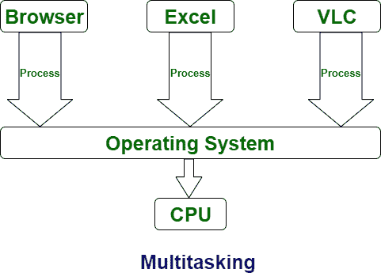

# 多任务和多线程的区别

> 原文:[https://www . geeksforgeeks . org/多任务和多线程的区别/](https://www.geeksforgeeks.org/difference-between-multi-tasking-and-multi-threading/)

先决条件–[多道程序、多任务、多线程和多处理](https://www.geeksforgeeks.org/difference-between-multitasking-multithreading-and-multiprocessing/)
**多任务:**
多任务是指提供一个 CPU 同时执行多个任务。多任务通常涉及任务之间的中央处理器切换，以便用户可以一起与每个程序协作。与多线程不同，在多任务处理中，进程共享单独的内存和资源。由于多任务处理涉及到中央处理器在任务之间快速切换，因此从一个用户切换到下一个用户只需要很少的时间。

**多线程:**
多线程是从一个进程中创建多个线程的系统，通过这个进程提高了计算机的能力。在多线程中，提供 CPU 是为了一次执行来自一个进程的多个线程，在多线程中，根据成本执行进程创建。与多任务处理不同，多线程为进程执行提供了相同的内存和资源。

让我们看看多任务和多线程的区别:

| S.NO | 多任务处理 | 多线程操作 |
| --- | --- | --- |
| 1. | 在多任务处理中，用户可以通过中央处理器执行许多任务。 | 而在多线程中，许多线程是从一个进程中创建的，通过这个进程，计算机的能力得到了提高。 |
| 2. | 多任务通常涉及任务之间的中央处理器切换。 | 而在多线程中，线程之间也经常涉及 CPU 切换。 |
| 3. | 在多任务处理中，进程共享单独的内存。 | 而在多线程中，进程被分配相同的内存。 |
| 4. | 多任务组件涉及多处理。 | 而多线程组件不涉及多处理。 |
| 5. | 在多任务处理中，提供 CPU 是为了一次执行许多任务。 | 而在多线程中，提供 CPU 是为了一次执行一个进程中的多个线程。 |
| 6. | 在多任务处理中，进程不共享相同的资源，每个进程被分配不同的资源。 | 而在多线程中，每个进程共享相同的资源。 |
| 7. | 与多线程相比，多任务处理速度较慢。 | 而多线程更快。 |
| 8. | 在多任务处理中，进程终止需要更多的时间。 | 而在多线程中，线程终止花费的时间更少。 |