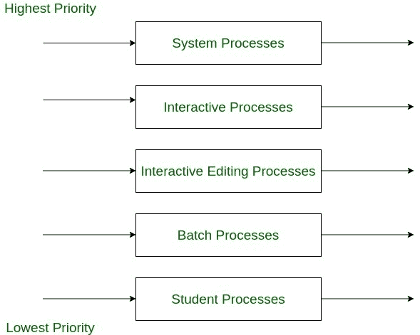
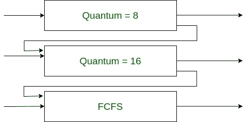

# 多级队列(MLQ)和多级反馈队列(MLFQ) CPU 调度算法的区别

> 原文:[https://www . geesforgeks . org/difference-multiple-queue-mlq-和-multiple-feedback-queue-mlfq-CPU-scheduling-algorithms/](https://www.geeksforgeeks.org/difference-between-multilevel-queue-mlq-and-multi-level-feedback-queue-mlfq-cpu-scheduling-algorithms/)

在多程序设计环境中，经常会发生多个进程同时争夺 CPU 资源的情况。如果只有一个可用的中央处理器，则必须在下一个运行的进程之间做出选择。操作系统中负责选择进程的部分称为调度程序，它使用的算法称为调度算法。

多程序设计的目标是最大化 CPU 利用率。提出了周转时间、响应时间、等待时间、吞吐量等标准，在此基础上判断调度算法。有很多 CPU 调度算法，其中两个是-

1.  [多级队列调度](https://www.geeksforgeeks.org/multilevel-queue-mlq-cpu-scheduling/)
2.  [多级反馈队列调度](https://www.geeksforgeeks.org/multilevel-feedback-queue-scheduling-mlfq-cpu-scheduling/)

**多级队列(MLQ)和多级反馈队列(MLFQ) CPU 调度算法的区别:**

<figure class="table">

| 多级队列调度(MLQ) | 多级反馈队列调度 |
| --- | --- |
| 这是一种队列调度算法，其中就绪队列被分成几个较小的队列，进程被永久分配到这些队列中。这些进程根据其固有特性(如内存大小、优先级等)进行划分。 | 在该算法中，就绪队列根据中央处理器突发特性被划分成更小的队列。进程不会永久分配给一个队列，而是允许在队列之间移动。 |
| 在该算法中，队列分为两组，第一组包含后台进程，第二组包含前台进程。
80%的 CPU 时间使用循环算法分配给前台队列，20%的时间使用先到先服务算法分配给后台进程。
 | 这里，队列分为高优先级队列和低优先级队列。如果进程执行时间较长，它将被移动到优先级较低的队列中。
因此，该算法将 I/O 边界和交互进程留在优先级更高的队列中。
 |
| 该算法中的优先级是固定的。当一个队列中的所有进程完全执行时，则只执行另一个队列中的进程。
因此，饥饿可以发生。
 | 进程的优先级是动态的，因为允许进程在队列之间移动。在较低优先级队列中花费较长时间的进程可以转移到较高优先级队列，反之亦然。
因此，它防止饥饿。
 |
| 由于进程不在队列之间移动，因此调度开销低且不灵活。 | 因为允许进程在队列之间移动，所以它具有高调度开销和灵活性。 |

**1。多级队列调度示例(MLQ) :**
下面按照优先级顺序列出了一个包含五个队列的多级队列。

1.  系统进程队列
2.  交互式进程队列
3.  交互式编辑进程队列
4.  批处理队列
5.  学生进程队列

这里，所有队列都有自己的调度算法，进程被选择为具有最高优先级。然后它被抢先或非抢先地执行。低优先级队列中的任何进程都不能被执行，直到高优先级队列全部为空。

例如，如果批处理队列正在运行，并且交互进程进入就绪状态，则批处理被抢占，交互进程被允许执行。

**2。多级反馈队列调度(MLFQ)示例:**
现在，让我们考虑具有三个队列的多级反馈队列。

1.  比如 Q1，一个 8 毫秒的循环队列。
2.  比如 Q2，时间量为 16 毫秒的循环队列。
3.  先到先得的队列，比如说第三季度。

现在，当进程进入 Q1 时，它被允许执行，如果它没有在 8 毫秒内完成，它将被转移到 Q2，并接收 16 毫秒。同样，如果它在 16 秒内没有完成，它将被抢占到 Q3。以这种方式，在该方案中进行调度。

</figure>