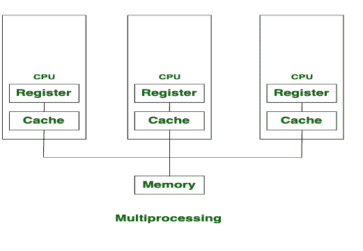
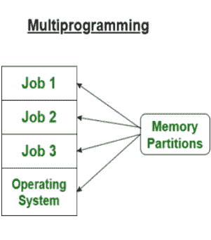

# 多处理和多程序之间的区别

> 原文:[https://www . geeksforgeeks . org/多重处理和多道程序设计的区别/](https://www.geeksforgeeks.org/difference-between-multiprocessing-and-multiprogramming/)

**1。多处理:**
多处理是指有两个或多个处理器的系统。在这种情况下，为了提高系统的计算速度，增加了中央处理器。由于多处理，有许多进程同时执行。多处理进一步分为两类:对称多处理，非对称多处理。

**2。多程序设计:**
多程序设计是一次运行多个进程，它通过组织作业(代码和数据)来提高 CPU 利用率，使 CPU 始终有一个要执行。动机是在主内存中保留多个作业。如果一个作业被输入/输出占用，可以将 CPU 分配给其他作业。

**多处理和多道程序设计的区别:**

| 没有。 | 多重处理 | 多道程序设计 |
| 1. | 每个系统有多个处理器，可以并行执行几组指令，这就是多处理。 | 主内存中多个程序的并发应用称为多道程序设计。 |
| 2. | CPU 的数量不止一个。 | CPU 的数量是一个。 |
| 3. | 作业处理花费的时间更少。 | 处理这些工作需要更多的时间。 |
| 4. | 在这种情况下，一次可以执行多个进程。 | 在这种情况下，一次只能执行一个进程。 |
| 5. | 很经济。 | 很经济。 |
| 6. | 用户数量可以是一个或多个。 | 用户数量是一次一个。 |
| 7. | 吞吐量最大。 | 吞吐量更少。 |
| 8. | 它的效率是最高的。 | 它的效率更低。 |

