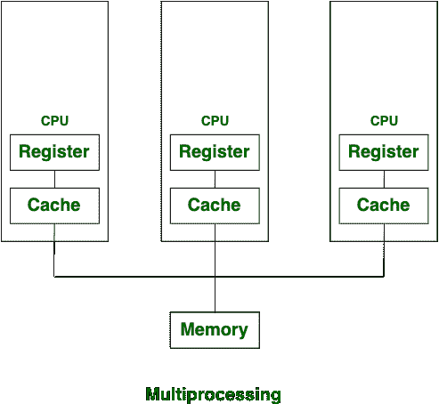
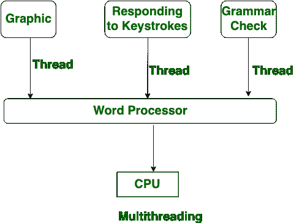

# 多处理和多线程的区别

> 原文:[https://www . geeksforgeeks . org/多处理和多线程的区别/](https://www.geeksforgeeks.org/difference-between-multiprocessing-and-multithreading/)

**多处理**和**多线程**都用于提高系统的计算能力。

**多处理:**
多处理是指拥有一个或两个以上处理器的系统。在多处理中，为了提高系统的计算速度，增加了中央处理器。由于多处理，有许多进程同时执行。多重处理分为两类:

```
1. Symmetric Multiprocessing
2. Asymmetric Multiprocessing 
```



**多线程:**
多线程是在一个进程中创建多个线程来提高系统计算速度的系统。在多线程中，一个进程的多个线程同时执行，多线程中的进程创建是根据经济性来完成的。



**多处理和多线程的区别:**

| S.NO | 多重处理 | 多线程操作 |
| 1. | 在多处理中，为了提高计算能力，增加了中央处理器。 | 而在多线程中，为了提高计算能力，许多线程是在单个进程中创建的。 |
| 2. | 在多处理中，许多进程同时执行。 | 而在多线程中，进程的许多线程同时执行。 |
| 3. | 多处理分为**对称**和**非对称**。 | 而多线程并不归入任何类别。 |
| 4. | 在多处理中，进程创建是一个耗时的过程。 | 而在多线程中，进程创建是根据经济的。 |
| 5. | 在多处理中，每个进程都有一个单独的地址空间。 | 而在多线程中，所有线程共享一个公共地址空间。 |