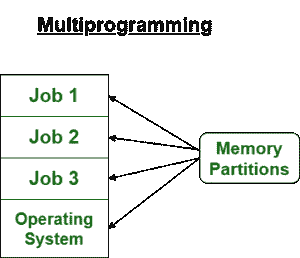
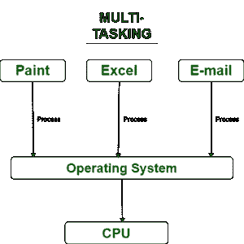

# 多道程序和多任务之间的区别

> 原文:[https://www . geesforgeks . org/多道程序和多任务之间的区别/](https://www.geeksforgeeks.org/difference-between-multiprogramming-and-multitasking/)

**多编程和多任务都与** [**操作系统概念**](https://www.geeksforgeeks.org/operating-systems/) 相关

中央处理器是一个超级快的设备，让它为一个单独的任务占用空间从来都不是一个好主意。考虑到中央处理器速度和输入输出速度之间的巨大差异，引入了许多概念，如多道程序设计、多任务处理、多线程等，以提高中央处理器的利用率。

**多程序设计:-**
多程序设计通过组织作业(代码和数据)来提高 CPU 利用率，这样 CPU 总是有一个作业要执行。这个想法是在主内存中保留多个作业。如果一个作业被输入输出占用，中央处理器可以分配给其他作业。

**多任务:-**
多任务是多道程序设计的逻辑扩展。多任务处理是一个操作系统在一台中央处理器上同时执行多个任务的能力。这些多任务共享公共资源(如 CPU 和内存)。在多任务系统中，中央处理器通过在它们之间切换来执行多个任务，通常使用很小的时间量，并且切换发生得如此之快，以至于用户感觉像同时与每个正在执行的任务交互。

**注:** 1。多任务系统中的任务不是整个应用程序，但当一个进程被划分为子任务时，它可以指“执行线程”。

2.多编程和多任务操作系统是分时系统。

**多道程序和多任务的区别**

<figure class="table">

| Sr.no  | **多道程序设计** | **多任务** |
| --- | --- | --- |
| 1.  | 这两个概念都是针对单 CPU 的。 | 这两个概念都是针对单 CPU 的。 |
| 2. | 使用了上下文切换的概念。 | 使用了上下文切换和时间共享的概念。 |
| 3. | 在多程序系统中，当当前作业需要等待时，操作系统只需切换到并执行另一个作业。 | 处理器通常用于分时模式。当允许的时间到期或当前进程有其他原因需要等待时(例如，进程需要进行输入输出)，就会发生切换。 |
| 4. | 多程序设计通过组织作业来提高 CPU 利用率。 | 在多任务处理中，也提高了 CPU 利用率，同时也提高了响应能力。 |
| 5. | 想法是尽可能长时间地减少 CPU 空闲时间。 | 想法是通过提高响应时间共享来进一步扩展 CPU 利用率概念。 |

大多数现代操作系统使用多任务处理和更复杂的设置。

</figure>