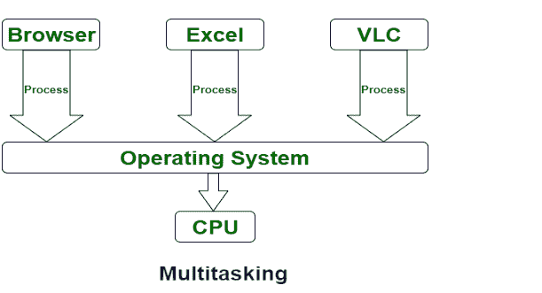

# 多任务和多处理的区别

> 原文:[https://www . geeksforgeeks . org/多任务和多处理的区别/](https://www.geeksforgeeks.org/difference-between-multitasking-and-multiprocessing/)

**1。多任务:**
多任务是多道程序设计的逻辑扩展。在这个系统中，中央处理器通过在它们之间切换来执行多个作业，通常使用很小的时间量，并且这些切换发生得如此频繁，以至于用户可以在每个程序运行时与之交互。多任务进一步分为两类:单用户&多用户。

**2。多处理:**
多处理是指有两个或两个以上处理器的系统。在这种情况下，为了提高系统的计算速度，增加了中央处理器。由于多处理，有许多进程同时执行。多处理进一步分为两类:对称多处理和非对称多处理。

**多任务和多处理的区别:**

<figure class="table">

| s 没有。 | 多任务处理 | 多重处理 |
| 1. | 同时执行多个任务被称为多任务处理。 | 每个系统有多个处理器，可以并行执行几组指令，这就是多处理。 |
| 2. | CPU 的数量是一个。 | 中央处理器的数量不止一个。 |
| 3. | 它需要适度的时间。 | 作业处理花费的时间更少。 |
| 4. | 在这种情况下，一次执行一个作业。 | 在这种情况下，一次可以执行多个进程。 |
| 5. | 很经济。 | 很经济。 |
| 6. | 用户数量不止一个。 | 用户数量可以是一个或多个。 |
| 7. | 吞吐量适中。 | 吞吐量最大。 |
| 8. | 其效率适中。 | 它的效率是最高的。 |
| 9. | 它有两种类型:单用户多任务和多用户多任务。 | 它有两种类型:对称多处理和非对称多处理。 |
| 10. | 用户任务的数量不止一个。 | 用户任务的数量可以是一个或多个。 |

</figure>