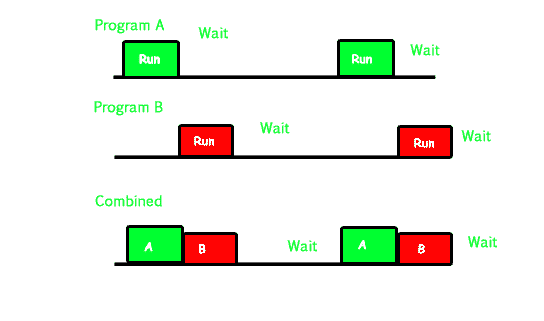
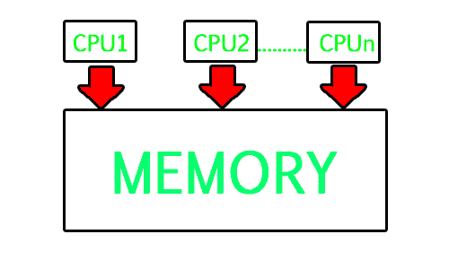
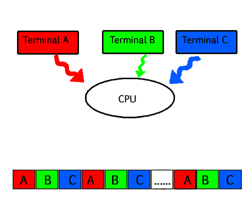

# 多道程序、多任务、多线程和多处理的区别

> 原文:[https://www . geeksforgeeks . org/区别-多任务-多线程-多处理/](https://www.geeksforgeeks.org/difference-between-multitasking-multithreading-and-multiprocessing/)

1.  **多道程序设计–**一台计算机一次运行多个程序(比如同时运行 Excel 和 Firefox)。
2.  **多处理–**一台计算机同时使用多个中央处理器。
3.  **多任务处理–**共享一个公共资源(比如 1 个 CPU)的任务。
4.  **多线程**是多任务的延伸。

### **1。多重编程–**

在现代计算系统中，通常有几个并发的应用程序进程想要执行。现在，操作系统有责任有效地管理所有流程。
操作系统最重要的一个方面就是多程序。
在一个计算机系统中，有多个进程等待执行，也就是说，它们在等待中央处理器何时被分配给它们，它们开始执行。这些过程也被称为作业。现在主内存太小，无法容纳所有这些进程或作业。因此，这些过程最初保存在一个名为作业池的区域中。这个作业池由所有等待分配主内存和中央处理器的进程组成。
CPU 从所有这些等待的作业中选择一个作业，将其从作业池带到主内存并开始执行。处理器执行一个作业，直到它被某个外部因素中断或者它去执行一个输入/输出任务。

**非多程序系统工作–**

*   在非多程序系统中，一旦一个作业离开了中央处理器，去执行其他任务(比如输入输出)，中央处理器就变成空闲的。中央处理器一直在等待，直到这个作业(之前执行的作业)返回，并与中央处理器一起恢复执行。因此，在此期间，中央处理器保持空闲。
*   现在它有一个缺点，那就是中央处理器在很长一段时间内保持空闲。此外，等待执行的其他作业可能没有机会执行，因为 CPU 仍分配给较早的作业。
    这带来了一个非常严重的问题，即使其他作业已经准备好执行，但由于中央处理器被分配给一个甚至没有利用它的作业(因为它正忙于输入/输出任务)，所以中央处理器没有被分配给它们。
*   不会发生一个作业使用 CPU 小时，而其他作业在队列中等待 5 小时的情况。为了避免这种情况，提高 CPU 的利用率，出现了多程序设计的概念。

多程序设计的主要思想是最大化 CPU 时间。
**多程序系统工作–**

*   在多程序系统中，一旦一个作业进入输入/输出任务，操作系统就会中断该作业，从作业池(等待队列)中选择另一个作业，将中央处理器交给这个新作业并开始执行。前一个作业继续执行其输入/输出操作，而这个新作业执行受 CPU 限制的任务。现在假设第二个作业也用于输入/输出任务，中央处理器选择第三个作业并开始执行它。一旦作业完成其输入/输出操作并回来执行中央处理器任务，中央处理器就会被分配给它。
*   这样，等待输入输出任务完成的系统就不会浪费 CPU 时间。
    因此，多编程的最终目标是只要有进程准备执行，就让 CPU 保持忙碌。这样，通过一次执行一个程序的一部分，之后执行另一个程序的一部分，然后执行另一个程序的一部分等等，可以在单个处理器上执行多个程序，从而执行多个程序。因此，中央处理器从不保持空闲。

下图中，程序 A 运行一段时间后进入等待状态。与此同时，程序 B 开始执行。所以 CPU 不浪费资源，给程序 B 一个运行的机会。

### **2。多处理–**

在单处理器系统中，一次只执行一个进程。
多处理是在单个计算机系统中使用两个或更多的 CPU(处理器)。该术语还指系统在单个计算机系统中支持多个处理器的能力。现在，由于有多个处理器可用，一次可以执行多个进程。这些多处理器共享计算机总线，有时还共享时钟、内存和外围设备。

**多处理系统工作–**

*   在多处理的帮助下，许多进程可以同时执行。比方说，P1、P2、P3 和 P4 正在等待处决。现在在单处理器系统中，首先执行一个进程，然后执行另一个进程，然后执行另一个进程，依此类推。
*   但是通过多处理，每个进程可以被分配给不同的处理器来执行。如果是双核处理器(2 个处理器)，两个进程可以同时执行，因此速度会快两倍，类似地，四核处理器的速度是单个处理器的四倍。

**为什么使用多重处理–**

*   多处理器系统的主要优点是在更短的时间内完成更多的工作。当需要非常高的速度来处理大量数据时，使用这些类型的系统。与单处理器系统相比，多处理器系统可以节省资金，因为处理器可以共享外围设备和电源。
*   它还提高了可靠性，因为如果一个处理器出现故障，工作不会停止，只会变慢。例如，如果我们有 10 个处理器，1 个出现故障，那么工作不会停止，而是剩余的 9 个处理器可以共享第 10 个处理器的工作。因此，整个系统的运行速度只慢 10%，而不是完全失败。

多处理指的是硬件(即中央处理器单元)而不是软件(即正在运行的进程)。如果底层硬件提供多个处理器，那么这就是多处理。它是系统利用多处理器计算能力的能力。

**多编程和多处理的区别–**

*   一个系统既可以通过同时运行多个程序进行多重编程，也可以通过使用多个物理处理器进行多重处理。多处理和多编程的区别在于，多处理基本上是在多个处理器上同时执行多个进程，而多编程是将几个程序保存在主内存中，并且仅使用单个 CPU 同时执行它们。
*   多处理是通过并行处理实现的，而多编程是通过从一个进程切换到另一个进程来实现的(这种现象称为上下文切换)。

### **3。多任务处理–**

顾名思义，多任务是指执行多个任务(比如进程、程序、线程等)。)一次。在现代操作系统中，我们可以同时播放 MP3 音乐、编辑微软 Word 文档、浏览谷歌浏览器，这是通过多任务的方式来实现的。

多任务是多程序设计的逻辑扩展。多任务处理与多程序设计的主要区别在于，多程序设计仅基于上下文切换的概念，而多任务处理基于时间共享和上下文切换的概念。

**多任务系统正在工作–**

*   在分时系统中，每个进程都被分配了某个特定的时间段，该时间段是进程要执行的时间。假设有 4 个流程 P1、P2、P3、P4 准备执行。因此，它们中的每一个都被分配了一些它们将执行的时间量，例如 5 纳秒(5 纳秒)的时间量。当一个进程开始执行时(比如 P2)，它会执行一段时间(5 纳秒)。5 纳秒后，中央处理器开始在指定的时间段内执行另一个进程(比如 P3)。
*   因此，中央处理器使进程在它们之间共享时间片并相应地执行。一旦一个进程的时间量到期，另一个进程就开始执行。
*   这里也基本上发生了上下文切换，但是它发生得如此之快，以至于用户能够在每个程序运行时分别与它进行交互。这样，用户会产生多个进程/任务同时执行的错觉。但实际上在特定时刻只有一个进程/任务在执行。在多任务处理中，时间共享得到了最好的体现，因为每个运行的进程只占用相当多的 CPU 时间。

在更一般的意义上，多任务是指多个程序、进程、任务、线程同时运行。在现代操作系统中，当多个任务共享一个公共的处理资源(例如，中央处理器和内存)时，使用这个术语。

*   如上图所示，在任何时候，中央处理器只执行一个任务，而其他任务正在等待轮到它们。当中央处理器被重新分配给另一个任务时，就会产生并行的错觉。即由于时间共享，所有三个任务 A、B 和 C 似乎同时发生。
*   因此，要进行多任务处理，首先应该有多道程序，即存在多个准备执行的程序。其次是分时的概念。

### **4。多线程–**

线程是 CPU 利用率的基本单位。多线程是一种执行模型，它允许单个进程在该进程的“上下文”中同时运行多个代码段(即线程)。
例如 VLC 媒体播放器，其中一个线程用于打开 VLC 媒体播放器，一个线程用于播放特定歌曲，另一个线程用于向播放列表添加新歌曲。

多线程是一个进程一次管理多个用户使用它的能力，以及管理同一用户的多个请求而不必拥有程序的多个副本的能力。

**多线程系统工作–**

**示例 1–**

*   假设有一个处理客户请求的网络服务器。现在，如果它作为单线程进程执行，那么它将不能同时处理多个请求。首先，一个客户端会发出请求并完成执行，只有这样，服务器才能处理另一个客户端的请求。这确实是一项成本高、耗时且累人的任务。为了避免这种情况，可以使用多线程。
*   现在，每当有新的客户端请求进来时，web 服务器只需创建一个新的线程来处理这个请求，然后继续执行以听到更多的客户端请求。因此，web 服务器的任务是监听新的客户端请求，并为每个单独的请求创建线程。每个新创建的线程处理一个客户端请求，从而减轻 web 服务器的负担。

**示例 2–**

*   我们可以将线程视为共享父进程资源但独立执行的子进程。现在以图形用户界面为例。假设我们正在图形用户界面上执行计算(这需要很长时间才能完成)。现在，在该命令执行完毕之前，我们无法与图形用户界面的其他部分进行交互。为了能够与图形用户界面的其余部分交互，这个计算命令应该分配给一个单独的线程。所以此时，将有 2 个线程在执行，即一个用于计算，一个用于图形用户界面的其余部分。因此，在单个进程中，我们使用多个线程来实现多个功能。

下图完整描述了 VLC 玩家的例子:

**多线程的优势–**

*   多线程的好处包括提高响应速度。由于一个程序中有多个线程，所以如果一个线程执行时间过长或者被阻塞，其余的线程继续执行没有任何问题。因此，整个程序通过剩余的线程保持对用户的响应。
*   多线程的另一个优点是成本更低。创建全新的进程并分配资源是一项耗时的任务，但是由于线程共享父进程的资源，因此创建线程并在它们之间切换相对容易。因此多线程是现代操作系统的需要。