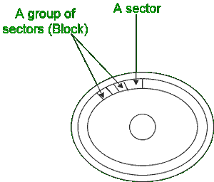

# 操作系统中页面和块的区别

> 原文:[https://www . geesforgeks . org/操作系统中页面和块的区别/](https://www.geeksforgeeks.org/difference-between-page-and-block-in-operating-system/)

在本文中，我们将讨论[操作系统](https://www.geeksforgeeks.org/introduction-of-operating-system-set-1/)中页面和块的概述，然后通过提及两者的特性来讨论它们的区别。我们一个一个来讨论。

**区块概述:**
区块是数据存储的最小单位。它用于读取文件或将数据写入文件。块也是位和字节的序列。区块由扇区组成。扇区是格式化磁盘上保存信息的物理位置。一个块由一个扇区或者甚至没有扇区(2，4，6..).块也称为物理记录。

**示例–**
PS DOS 使用了 65，536 个块地址(之前，现在使用页面)。默认的 NTFS 块大小是 4096 字节。

格式化的磁盘

**区块特征:**

*   大多数操作系统使用块来存储数据。
*   当我们将数据放入块中时，称为分块，当我们从块中提取数据时，称为去块。
*   积木可以有不同的大小。块的大小称为块大小。
*   操作系统中的每个文件至少占用一个块，即使它是 0 字节。
*   块为负责存储和检索数据的硬件提供了一个抽象级别。
*   阻塞提高了数据处理流的速度并减少了开销。

**页面概述:**
页面也是数据存储的单位。页面从主存储器加载到处理器中。页面由单元块或块组组成。页面大小固定，通常为 2k 或 4k。页面也称为虚拟页面或内存页面。当页面在主内存和辅助内存之间传输时，这就是所谓的分页。详见 https://www.geeksforgeeks.org/paging-in-operating-system/。

**示例–**
描述页面使用的一个著名示例是存储区域网络。存储区域网络(SAN)使用分页在驱动程序类型之间移动数据。

描述分页的框图。页面映射表包含从页码 0 到 7 的页面

**页面功能:**

*   页面大小由处理器架构决定。
*   一些操作系统使用页面而不是块。
*   页面是内存中最小的存储单元，与内存相当。
*   如果主存储器中不存在处理器所需的页面，则称之为页面错误，并由称为页面错误例程的特殊例程带入主存储器。
*   在主内存中获取所需页面的技术称为页面要求。
*   页面充当操作系统和硬盘之间的中间人。

**结论:**
页面比块更受 OS 青睐。第一个原因是，当有多个存储设备时，处理页面比处理块更容易。此外，页面大小通常是固定的，块的大小也各不相同。然而，页和块都是数据存储单元。