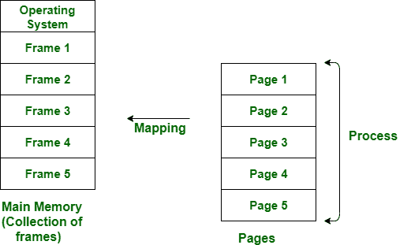
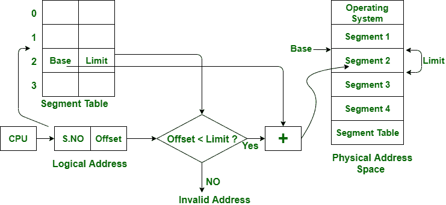

# 分页和分段的区别

> 原文:[https://www . geesforgeks . org/分页和分段的区别/](https://www.geeksforgeeks.org/difference-between-paging-and-segmentation/)

****:**
分页是一种用于非连续内存分配的方法或技术。它是一个固定大小的分区主题(方案)。在分页中，主内存和辅助内存都被分成大小相等的固定分区。二级存储区单元和主存储区单元的分区分别称为页和帧。**

**分页是一种内存管理方法，习惯于以页面的形式将进程从辅助内存提取到主内存中。在分页中，只要每个部分的大小与页面大小相同，每个进程就会被分成几个部分。后半部分的大小也可能只有页面大小。处理区单元的页面依靠它们的可访问性保留在主存储器的框架内。**

****

**[**分段**](https://www.geeksforgeeks.org/segmentation-in-operating-system/) **:**
分段是另一种类似分页的非连续内存分配方案。与分页一样，在分段中，进程不会被随意划分为挂载(固定)大小的页面。它是可变大小分区主题。与分页一样，在分段中，辅助内存和主内存也不被划分为大小相等的分区。二级存储区单元的分区，称为段。关于每个分段的细节保存在一个称为分段表的表中。段表包含关于段的两个主要数据，一个是 Base，它是段的底部地址，另一个是 Limit，它是段的长度。**

**在分段中，中央处理器生成包含段号和段偏移量的逻辑地址。如果段偏移量小于限制值，则该地址称为有效地址，否则会因地址无效而导致计算错误。**

****

**上图显示了逻辑地址到物理地址的转换。**

<figure class="table">

| S.NO | 分页 | 分割 |
| --- | --- | --- |
| 1. | 在分页中，程序分为固定大小的页面和装入的页面。 | 在分段中，程序被分成大小可变的部分。 |
| 2. | 对于分页操作系统是有责任的。 | 对于分段编译器是有责任的。 |
| 3. | 页面大小由硬件决定。 | 这里，截面尺寸由用户给出。 |
| 4. | 分割比较快。 | 分割很慢。 |
| 5. | 分页可能会导致内部碎片。 | 分割可能导致外部碎片。 |
| 6. | 在分页中，逻辑地址分为页码和页偏移量。 | 这里，逻辑地址分为段号和段偏移。 |
| 7. | 分页包括一个包含每一页的基址的页表。 | 而分段还包括包含段号和段偏移的段表。 |
| 8. | 页表用于保存页数据。 | 区段表维护区段数据。 |
| 9. | 在分页中，操作系统必须维护一个空闲帧列表。 | 在分段中，操作系统在主内存中维护一个漏洞列表。 |
| 10. | 用户看不到分页。 | 用户可以看到细分。 |
| 11. | 在分页中，处理器需要页码、偏移量来计算绝对地址。 | 在分段中，处理器使用段号、偏移量来计算全地址。 |
| 12. | 很难允许流程之间共享过程。 | 促进流程之间的程序共享。 |
| Thirteen | 在分页中，程序员不能有效地处理数据结构。 | 它可以有效地处理数据结构。 |
| 14. | 在这种保护下很难适用。 | 易于在分段中应用保护。 |

</figure>