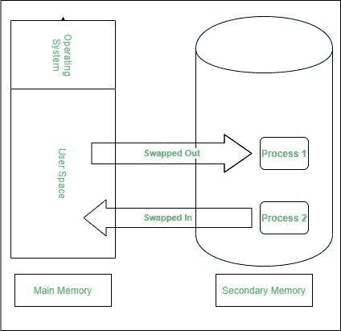
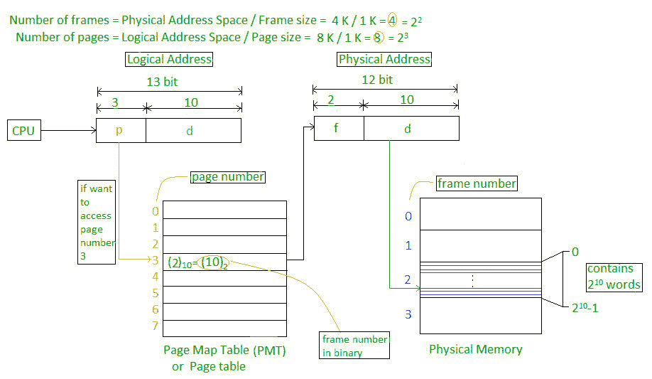

# 操作系统中分页和交换的区别

> 原文:[https://www . geesforgeks . org/分页和换入操作系统的区别/](https://www.geeksforgeeks.org/difference-between-paging-and-swapping-in-os/)

**[交换](https://practice.geeksforgeeks.org/problems/swapping-of-processes) :**
交换是将进程从主内存临时交换到辅助内存的过程，与辅助内存相比速度更快。但是由于[内存](https://www.geeksforgeeks.org/different-types-ram-random-access-memory/)的大小较小，所以不活动的进程被转移到辅助内存。交换的主要部分是传输时间，总时间与交换的内存量成正比。

**[分页](https://www.geeksforgeeks.org/paging-in-operating-system/) :**
分页是内存分配的过程，其中不同的非连续内存块被分配一个固定的大小。大小一般为 4KB。分页总是在活动页面之间执行。

**分页和交换的区别:**

| 交换 | 分页 |
| --- | --- |
| 这是复制整个过程的程序。 | 这是一种内存分配技术。 |
| 交换发生在整个过程转移到磁盘时。 | 当进程的某些部分转移到磁盘时，就会发生分页。 |
| 在此过程中，会暂时从主内存交换到辅助内存。 | 在这种情况下，连续的内存块是不连续的，但具有固定的大小，称为帧或页面。 |
| 交换可以在没有任何内存管理的情况下执行。 | 非连续内存管理。 |
| 交换由非活动进程完成。 | 只有活动进程才能执行分页。 |
| 它提供了解决方案的方向。 | 对于其中的解决方案，没有给出任何建议。 |

