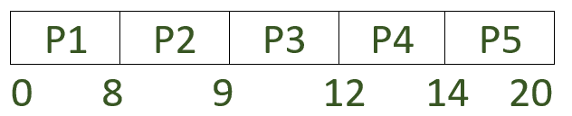

# 基于抢占优先级和基于非抢占优先级的 CPU 调度算法的区别

> 原文:[https://www . geesforgeks . org/基于优先级的抢占式和基于优先级的非抢占式 cpu 调度算法的区别/](https://www.geeksforgeeks.org/difference-between-preemptive-priority-based-and-non-preemptive-priority-based-cpu-scheduling-algorithms/)

先决条件–[CPU 调度](https://www.geeksforgeeks.org/cpu-scheduling-in-operating-systems/)
**优先级调度:**
在优先级调度中，每个进程都有一个优先级，该优先级是分配给它的整数值。
最小的整数被认为是最高优先级，最大的整数被认为是最低优先级。优先级最高的进程首先获得 CPU。

在罕见的系统中，最大的数量也可能被视为最高优先级，因此这完全取决于实现。

如果优先级是内部定义的，那么一些可测量的量，例如时间限制、内存需求、打开文件的数量以及平均输入/输出突发与平均 CPU 突发的比率，被用来计算优先级。
外部优先级是根据过程的重要性、为计算机使用支付的资金类型和金额、赞助工作的部门等因素来分配的。

先占和不先占 [SJF](https://www.geeksforgeeks.org/shortest-job-first-or-sjf-cpu-scheduling-non-preemptive-algorithm-using-segment-tree/) 是优先级调度，优先级是作业执行时间最短的。在该算法中，低优先级进程可能永远不会执行。这叫做饥饿。

解决饥饿问题的办法是衰老。在老化中，随着时间的推移，增加进程的优先级，以便最低优先级的进程逐渐转换为最高优先级。

1.  **Priority Preemptive Scheduling :** 
    Sometimes it is important to execute higher priority tasks immediately even when a task is currently being executed. For example, when a phone call is received, the CPU is immediately assigned to this task even if some other application is currently being used. This is because the incoming phone call has a higher priority than other tasks. This is a perfect example of priority preemptive scheduling. If a task with higher priority than the current task being executed arrives then the control of the CPU is taken from the current task and given to the higher priority task. 
2.  **优先级非抢占式调度:**
    与优先级抢占式调度不同，即使优先级较高的任务确实到达，也要等待当前任务释放 CPU 后才能执行。它经常用于各种硬件程序，如定时器等。

**注意:**
如果所有进程同时到达，那么优先级抢占式调度和优先级非抢占式调度的工作方式相同。

现在我们来做一个抢占式优先级调度和非抢占式优先级调度的对比研究。

<figure class="table">

| 优先级抢先调度 | 优先级非抢先调度 |
| --- | --- |
| 如果一个比当前正在执行的进程优先级更高的进程到达，中央处理器被预先分配给优先级更高的进程。 | 一旦资源被分配给一个进程，即使一个具有更高优先级的进程被添加到队列中，该进程也会一直保持它，直到它完成突发时间。 |
| 抢先调度更加灵活。 | 非抢先调度是刚性的。 |
| 具有最高优先级的进程的等待时间将始终为零。 | 具有最高优先级的进程的等待时间可能不为零。 |
| 成本更高，实施难度更大。在切换中也浪费了很多时间。 | 它实现起来更便宜，并且更快，因为需要更少的开关。 |
| 它在高优先级进程不能保持等待的应用程序中非常有用。 | 它可以用于各种硬件应用，在这些应用中等待不会导致任何严重问题。 |

**示例:**

<figure class="table">

| 过程 | 到达时间 | 突发时间 | 优先 |
| --- | --- | --- | --- |
| 第一亲代 | Zero | eight | three |
| P2 | one | one | one |
| P3 | Two | three | Two |
| P4 | three | Two | three |
| 孕烯醇酮 | four | six | four |

让我们试着用这两种算法来解决这个问题，做一个比较研究。

**1。优先级非抢先调度:**
甘特图如下:



平均等待时间(AWT)，

```
= ((0-0) + (8-1) + (9-2) + (12-3) + (14-4)) / 5 
= 33 / 5 
= 6.6 
```

平均周转时间(TAT)，

```
= ((8-0) + (9-1) + (12-2) + (14-3) + (20-4)) / 4 
= 53 / 5 
= 10.6 
```

**2。优先优先调度:**
甘特图如下:


平均等待时间(AWT)，

```
= ((5-1) + (1-1) + (2-2) + (12-3) + (14-4)) / 5 
= 23/5 
= 4.6 
```

平均周转时间(TAT)，

```
= ((12-0) + (2-1) + (5-2) + (14-3) + (20-4)) / 5 
= 43 / 5 
= 8.6 
```

</figure>

</figure>