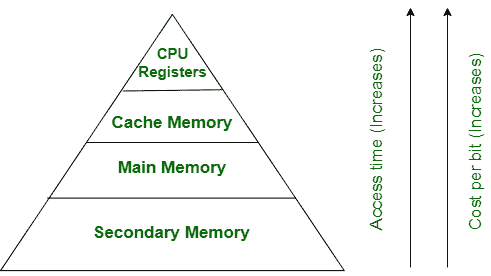

# 主内存和辅助内存的区别

> 原文:[https://www . geeksforgeeks . org/主次内存之差/](https://www.geeksforgeeks.org/difference-between-primary-and-secondary-memory/)

[计算机存储器](https://www.geeksforgeeks.org/levels-of-memory-in-operating-system/)存储数据和指令。内存系统可分为 4 类:

*   中央处理器寄存器
*   高速缓冲存储器
*   主/主存储器
*   辅助存储器/大容量存储器

它们可以以分层形式表示为:

**1。主/主内存:**
主内存是指可由中央处理器直接访问的计算机内存。它由动态随机存取存储器组成，为处理器提供实际的工作空间。它保存处理器当前正在处理的数据和指令。

**2。辅助存储器/大容量存储器:**
辅助存储器的内容首先被传送到主存储器，然后被处理器访问，这是因为处理器不直接与辅助存储器交互。

现在，让我们看看主内存和辅助内存之间的区别:

| 不，先生。 | 主存储器 | 辅助存贮器 |
| --- | --- | --- |
| 1. | 主内存是临时的。 | 二级记忆是永久的。 |
| 2. | 主内存可由处理器/中央处理器直接访问。 | 辅助内存不能被中央处理器直接访问。 |
| 3. | 主内存各部分的性质不同，内存本质上是易失性的。只读存储器-非易失性。 | 它本质上总是不稳定的。 |
| 4. | 主存储设备比辅助存储设备更贵。 | 与主存储器设备相比，辅助存储器设备更便宜。 |
| 5. | 用于主存储器的存储器件是半导体存储器。 | 辅助存储设备是磁存储器和光存储器。 |
| 6. | 主存储器也称为主存储器或内部存储器。 | 辅助存储器也称为外部存储器或辅助存储器。 |
| 7. | 例如:随机存取存储器、只读存储器、高速缓冲存储器、可编程只读存储器、可编程只读存储器、寄存器等。 | 例如:硬盘、软盘、磁带等。 |

