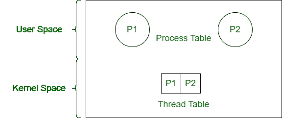

# 进程和内核线程的区别

> 原文:[https://www . geeksforgeeks . org/进程与内核线程的区别/](https://www.geeksforgeeks.org/difference-between-process-and-kernel-thread/)

**1。流程:**
流程是执行程序的活动。流程有两种类型——用户流程和系统流程。过程控制块控制过程的操作。

**2。内核线程:**
内核线程是一种在内核级管理进程线程的线程类型。内核线程由操作系统调度(内核模式)。

**进程与内核线程的区别:**

| 过程 | 内核线程 |
| --- | --- |
| 进程是正在执行的程序。 | 内核线程是在内核级管理的线程。 |
| 开销很大。 | 开销中等。 |
| 进程之间没有共享。 | 内核线程共享地址空间。 |
| 操作系统使用进程表调度进程。 | 内核线程由操作系统使用线程表来调度。 |
| 它是重重量活动。 | 与工艺相比，它重量轻。 |
| 可以暂停。 | 不能暂停。 |
| 暂停一个进程不会影响其他进程。 | 内核线程的挂起导致所有线程停止运行。 |
| 其类型有——用户流程和系统流程。 | 它的类型有——内核级单线程和内核级多线程。 |

