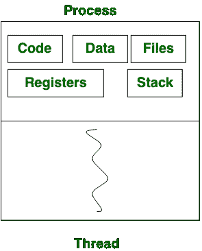

# 工艺和螺纹的区别

> 原文:[https://www . geeksforgeeks . org/进程和线程的区别/](https://www.geeksforgeeks.org/difference-between-process-and-thread/)

**进程-**
进程基本上是从就绪状态调度出来的程序，在 CPU 中调度执行。PCB( [过程控制块](https://www.geeksforgeeks.org/process-table-and-process-control-block-pcb/))持有过程的概念。一个进程可以创建称为子进程的其他进程。该进程需要更多的时间来终止，并且它是隔离的，这意味着它不与任何其他进程共享内存。

该过程可以具有如下[状态](https://www.geeksforgeeks.org/states-of-a-process-in-operating-systems/)，如新的、准备好的、运行的、等待的、终止的、暂停的。

**Thread-**
Thread 是进程的段，表示一个进程可以有多个线程，这些多个线程包含在一个进程中。线程有三种状态:运行、就绪和阻塞。

与进程相比，线程终止花费的时间更少，但与进程不同，线程不会隔离。

进程与线程

## **工艺和螺纹的区别:**

<figure class="table">

| S.NO | 过程 | 线 |
| --- | --- | --- |
| 1. | 进程意味着任何程序都在执行。 | 线程是指进程的一部分。 |
| 2. | 终止流程需要更多时间。 | 线程终止花费的时间更少。 |
| 3. | 创作需要更多的时间。 | 创作花费的时间更少。 |
| 4. | 上下文切换也需要更多的时间。 | 上下文切换花费的时间更少。 |
| 5. | 就沟通而言，流程效率较低。 | 线程在通信方面效率更高。 |
| 6.  | 多程序设计包含了多进程的概念。 | 我们不需要多线程的多程序运行，因为一个进程由多个线程组成。 |
| 7. | 过程是孤立的。 | 线程共享内存。 |
| 8. | 过程称为重重量过程。 | 线程是轻量级的，因为进程中的每个线程共享代码、数据和资源。 |
| 9. | 进程切换使用操作系统中的接口。 | 线程切换不需要调用操作系统并导致内核中断。 |
| 10. | 如果一个进程被阻塞，那么它不会影响其他进程的执行 | 同一任务中的第二个线程无法运行，而一个服务器线程被阻止。 |
| 11. | 进程有自己的进程控制块、堆栈和地址空间。 | 线程有父母的印刷电路板，自己的线程控制块和堆栈和公共地址空间。 |
| 12. | 如果一个进程被阻止，那么在第一个进程被解除阻止之前，其他进程都不能执行。 | 当一个线程被阻塞并等待时，同一任务中的第二个线程可以运行。 |
| 13. | 对父进程的更改不会影响子进程。 | 由于同一进程的所有线程共享地址空间和其他资源，因此对主线程的任何更改都可能影响该进程其他线程的行为。 |

</figure>