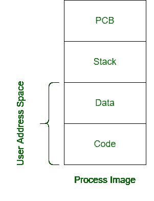
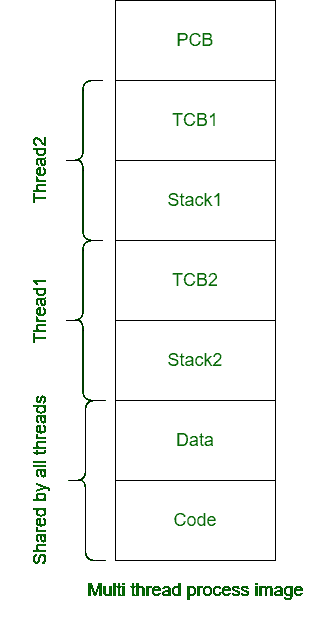

# 工艺图像和多线程工艺图像的区别

> 原文:[https://www . geesforgeks . org/process-image 和多线程-process-image 的区别/](https://www.geeksforgeeks.org/difference-between-process-image-and-multi-thread-process-image/)

**1。过程映像:**
过程映像是任何过程执行期间所需的可执行文件。它由与流程执行相关的几个部分组成。
以下是过程图像的内容–

```
1. Process Control Block
2. Stack
3. Data
4. Code 
```



**1。多线程进程映像:**
多线程进程映像是任何线程执行期间所需的可执行文件。它由几个与线程执行相关的段组成。
以下是多线程进程映像的内容–

```
1. Process Control Block
2. Thread Control Block
3. Stack
4. Data
5. Code 
```



**流程图与多线程流程图的区别:**

<center>

| 过程图象 | 多线程处理图像 |
| --- | --- |
| 它是进程执行过程中需要的可执行文件。 | 它是线程执行期间所需的可执行文件。 |
| 它总共由四个部分组成。 | 它由每个线程的 2 个段和 3 个公共段组成。 |
| 创建过程映像需要更多时间。 | 创建单线程映像花费的时间更少。 |
| 在两个过程图像之间切换需要更多时间。 | 在两个线程映像之间切换花费的时间更少。 |
| 不同的进程共享不同的内存和不同的图像。 | 多线程进程映像中的公共地址空间由所有线程共享。 |
| 它使用了用户地址空间。 | 它使用公共地址空间。 |
| 过程图像之间的通信很困难。 | 两个线程映像之间的通信很简单。 |
| 过程图像中使用单个控制块。 | 一个控制块用于父进程，一个用于线程。 |

</center>