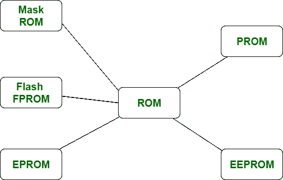

# 可编程只读存储器和可编程只读存储器的区别

> 原文:[https://www . geesforgeks . org/prom 和 eprom 之间的区别/](https://www.geeksforgeeks.org/difference-between-prom-and-eprom/)

**PROM** 代表**可编程只读存储器**是只读存储器的类型。它旨在满足一组只读存储器的要求，这些只读存储器可能包含选定的存储内容。它的存储器只写一次，并由用户在初始芯片制造时进行电编程。所需的内容文件由用户配备，并插入被称为存储编码器的机器中。每个可编程关联都有一个保险丝，一旦不需要关联，保险丝就会熔断。

**EPROM** 代表**可擦可编程只读存储器**也是光学读写的 ROM 类型。为了写入相关的 EPROM，其存储单元应该保持在相同的初始状态。与可编程只读存储器相比，可编程只读存储器的存储持久性降低，因为可编程只读存储器容易受到辐射和电噪声的影响。在 EPROM 的构造中，使用了 MOS 晶体管。

可编程只读存储器和可擦除可编程只读存储器的主要区别是，可编程只读存储器可以只编程一次，这意味着它只能被写入一次，而可擦除可编程只读存储器是可擦除的；因此它可以被重新编程。

让我们看看可编程只读存储器和可编程只读存储器的区别:

| S.NO | 毕业舞会 | 可擦可编程只读存储器 |
| --- | --- | --- |
| 1. | 可编程只读存储器不可重复使用。 | 而 EPROM 是可以多次重复使用的。 |
| 2. | 舞会不贵。 | 虽然比舞会贵。 |
| 3. | PROMS 的过程是不可逆的，意味着它的记忆是永久的。 | 而 EPROM 的过程可以颠倒过来。 |
| 4. | 可编程只读存储器的存储耐久性高。 | 而 EPROM 对可编程只读存储器的存储耐久性不如可编程只读存储器。 |
| 5. | 舞会是完全覆盖在一个塑料罩。 | 而电子顺磁共振则被装在一个水晶窗口里，这样紫外线就会穿过它。 |
| 6. | 可编程只读存储器是只读存储器的类型。 | 而 EPROM 也是光学读写的只读存储器。 |
| 7. | 如果在可编程只读存储器上写的时候有计算错误或错误或错误，它就会变得不可用。 | 然而，如果在 EPROM 上写的时候有计算错误或错误或错误，它仍然会被再次使用。 |
| 8. | 可编程只读存储器是 EPROM 的旧版本。 | 而 EPROM 是现代版的 PROM。 |
| 9. | 从灵活性和规模上来说，PROM 比 EPROM 更好。 | 而 EPROM 的灵活性和可扩展性较差。 |
| 10. | 在可编程只读存储器中，使用双极晶体管。 | 而在 EPROM 中，使用的是 MOS 晶体管。 |

