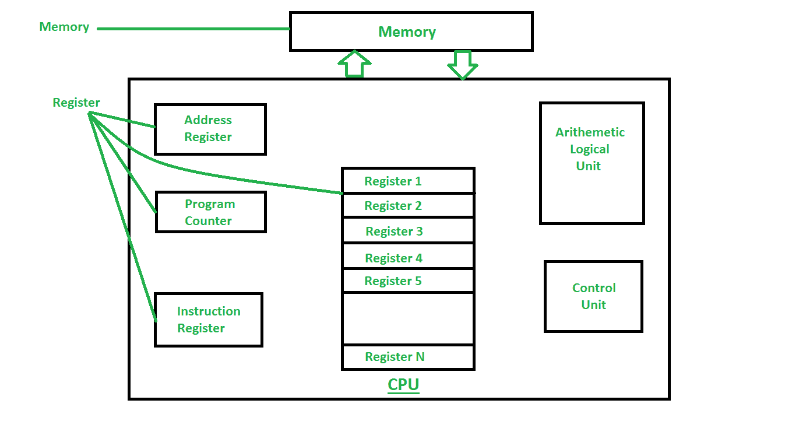
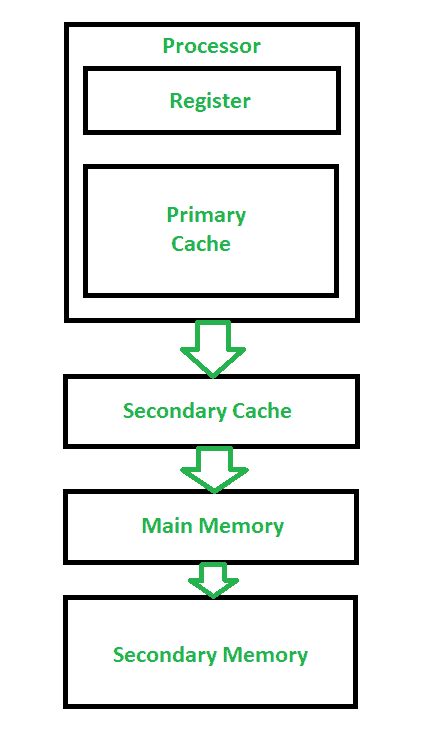

# 寄存器和存储器的区别

> 原文:[https://www . geesforgeks . org/register-and-memory 之差/](https://www.geeksforgeeks.org/difference-between-register-and-memory/)

**1。[寄存器](https://practice.geeksforgeeks.org/problems/what-is-register) :**
寄存器是内置于处理器本身的最小数据保存元素。这些是处理器可以直接访问的内存位置。它可以保存指令、存储地址或任何类型的数据，如位序列或单个字符。例如，一条指令可以指定将两个定义的寄存器的内容相乘，然后放入一个特定的寄存器。

例如:累加器寄存器、程序计数器、指令寄存器、地址寄存器等。

**2。[内存](https://www.geeksforgeeks.org/different-types-ram-random-access-memory/) :**
内存是用于存储计算机程序、指令和数据的硬件设备。处理器内部的内存是主内存(RAM)，处理器外部的内存是[辅助内存(硬盘)](https://www.geeksforgeeks.org/introduction-of-secondary-memory/)。存储器也可以根据易失性和非易失性存储器来分类。易失性存储器是当计算机或硬件设备断电时丢失其内容的存储器。[随机存取存储器](https://www.geeksforgeeks.org/random-access-memory-ram-and-read-only-memory-rom/)是易失性存储器的一个例子。非易失性存储器是即使断电也能保存其内容的存储器。 [EPROM](https://www.geeksforgeeks.org/difference-between-eprom-and-eeprom/) 是非易失性存储器的一个例子。

例如:随机存取存储器、可编程只读存储器等。

**语域和记忆的区别:**

| 没有 | 注册 | 记忆 |
| --- | --- | --- |
| 1. | 寄存器保存中央处理器当前正在处理的操作数或指令。 | 内存保存着 CPU 中当前正在执行的程序所需的指令和数据。 |
| 2. | 寄存器保存大约 32 位到 64 位的少量数据。 | 计算机的内存可以从几 GB 到几 TB 不等。 |
| 3. | CPU 可以在一个时钟周期内以超过一次操作的速率对寄存器内容进行操作。 | 中央处理器访问内存的速度比寄存器慢。 |
| 4. | 类型有累加器寄存器、程序计数器、指令寄存器、地址寄存器等。 | 内存类型有内存等。 |
| 5. | 寄存器可以被控制，也就是说，你可以存储和检索信息。 | 记忆几乎是不可控的。 |
| 6. | 寄存器比内存快。 | 内存比寄存器慢得多。 |

