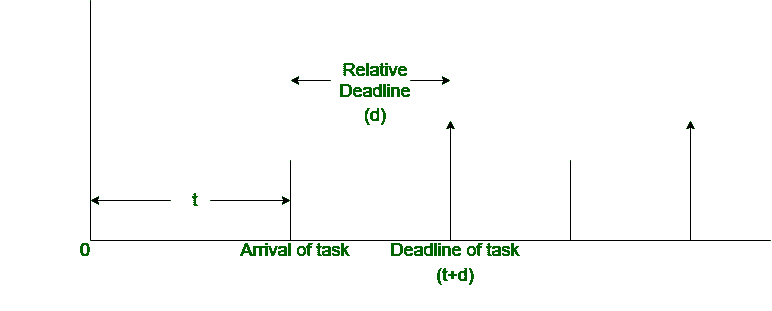
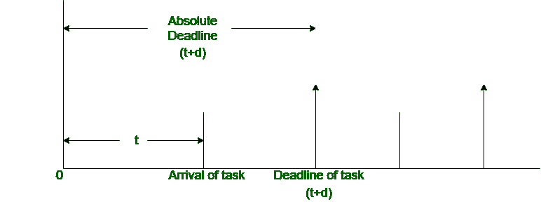

# 实时任务相对和绝对截止时间的差异

> 原文:[https://www . geeksforgeeks . org/实时任务相对与绝对截止日期之差/](https://www.geeksforgeeks.org/difference-between-relative-and-absolute-deadline-of-real-time-task/)

**1。【相对截止时间:**
任务开始到实时任务完成之间的时间间隔称为相对截止时间。它基本上是实时任务到达和相应截止时间之间的时间间隔。
如果任务的到达时间为‘t ’,对应的任务截止时间为‘t+d ’,

```
Relative deadline = d 
```



**2。绝对截止时间:**
时间 0 到实时任务完成之间的时间间隔称为相对截止时间。基本上是时间 0 到实时任务对应截止时间的时间间隔。
如果到达时间为“t ”,对应的任务截止时间为“t+d ”,则，

```
Absolute deadline = t+d 
```



**实时任务相对与绝对截止时间的差异:**

<center>

| 相对截止日期 | 绝对截止日期 |
| --- | --- |
| 它是任务到达和相应期限之间的时间间隔。 | 它是时间 0 和任务的相应截止时间之间的时间间隔。 |
| 这取决于任务的到达时间。 | 它不取决于任务的到达时间。 |
| 它主要用于计算工作。 | 它不用于计算工作。 |
| 如果任务的 A.T 为 T，截止日期为(t+d)，则相对截止日期为“d”。 | 如果任务的 A.T 为 T，截止时间为(t+d)，则绝对截止时间为(t+d)。 |
| 它可能小于或等于绝对截止日期。 | 它总是大于或等于相对截止日期。 |
| 这是实时任务的最大允许响应时间。 | 它是发布时间和相对截止日期的总和。 |

</center>