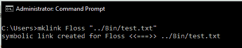
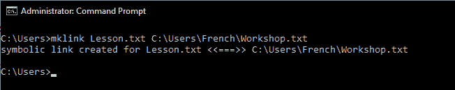

# 相对符号和绝对符号的区别

> 原文:[https://www . geeksforgeeks . org/相对和绝对符号链接之间的差异/](https://www.geeksforgeeks.org/difference-between-relative-and-absolute-symlinks/)

**符号链接(又名 symlink)** 是不存储任何数据的文件，而是以绝对或相对路径的形式引用另一个文件或目录。严格来说，符号链接不一定是文件，而是文件系统对象。符号链接不占用任何空间(占用 0 字节的空间)，而是作为文件表中的特殊条目存在。许多操作的符号链接的行为就像直接在目标文件上操作一样。在创建符号链接期间，类型与用于访问目标的最终符号链接相关联。符号链接可以有两种类型**相对**或**绝对**。在本文中，我们将了解这两种类型的符号链接之间的区别，并学习如何创建它们。

**符号链接的类型:**
符号链接有两种类型:绝对符号链接和相对符号链接。这些解释如下。

**1。相对符号链接:**
相对符号链接是一个符号链接，其目标有相对路径。相对路径是基于当前工作目录的路径。目标文件/文件夹的路径将根据 symlink 的当前路径计算。因此，没有明确的路径可以说。因为路径总是根据 symlink 的当前位置计算的。例如，让我们假设一个符号链接(文件)有以下目标路径。

```
..\Apples

```

上述符号链接是相对符号链接。原因是因为它有..(双句点)在其路径中，表示文件服务器当前所在目录的父目录。这个 makes 是动态的，因为文件可以在任何地方，但是它会在其父目录中一个名为 apples 的文件中寻找目标文件。因此，目标路径依赖于文件路径。

应当注意，双周期(..)不是连续的文字两个句点，而是引用父目录的目录操作数。

**创建相对符号链接:**
要在窗口上创建相对符号链接，我们将使用 mklink 命令。创建相对符号链接的语法如下:

```
mklink new_Link_name Target_path

```

目标路径应该是相对的。在以下示例中，我们将创建一个名为 Floss 的文件符号链接，其目标文件(名为*test.jpg*)位于其父目录的一个子目录(名为 *Bin* )中。

**示例:**



为了在窗口上创建符号链接，命令提示符( **cmd** )必须以提升的权限执行

**2。绝对符号链接:**
绝对符号链接是符号链接，其目标是绝对/全路径。绝对路径是独立存在且不依赖于当前工作目录的路径。无论符号链接的位置如何，目标文件/文件夹的路径都将始终相同。例如，让我们假设符号链接(文件)具有以下目标路径。

```
C:\Program Files\Windows\Leon.txt

```

上述符号链接是绝对符号链接。原因是它包含硬编码的目标路径。因此，不管符号链接的位置如何，目标文件的查找将只针对一个路径。

**创建绝对符号链接:**
要在窗口上创建绝对符号链接，我们将使用 mklink 命令。创建相对符号链接的语法如下:

```
mklink new_Link_name full_Target_path

```

full_target_path 应该是目标文件的完整路径(包括驱动器说明符)。在下面的例子中，我们将创建一个名为*的文件符号链接，目标文件位于*C:\ user \ French \ workshop . txt**

**示例:**

注意:
需要注意的是，符号链接的类型(相对/绝对)不依赖于提供源路径(New_Link_Path)的方式。因此，可以根据偏好提供相对或绝对的新链接路径，因为它不会影响符号链接的类型。这是类型的决定因素 ***目标路径*** 。