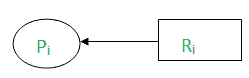
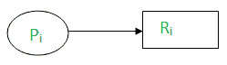
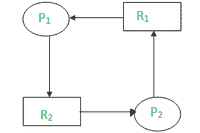
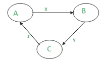

# 分布式系统中资源和通信死锁的区别

> 原文:[https://www . geesforgeks . org/resource-and-communication-distributed-system 中的死锁之间的区别/](https://www.geeksforgeeks.org/difference-between-resource-and-communication-deadlocks-in-distributed-systems/)

当一组进程请求已经被组中其他进程占用的资源时，就会发生死锁。因为每个进程拥有一个资源，并等待另一个进程持有的另一个资源，所以两个或多个进程的执行被阻止。

发生死锁必须满足四个要求:

1.  **互斥–**
    系统中至少有一个资源一次只能被一个进程使用。
2.  **保持&等待–**
    必须有一个进程在等待另一个进程获取另一个资源的同时保留一个资源。
3.  **无抢占–**
    意味着资源不能从一个进程中强行拿走，交给另一个进程。
4.  **循环等待–**
    所有进程必须以循环方式等待资源，最后一个进程等待第一个进程的资源。

分布式系统死锁与集中式系统死锁非常相似。在集中式系统中，我们有一个单一的操作系统，可以管理资源分配并确定是否存在死锁。当进程和资源分布时，更难检测、避免和防止死锁。处理死锁有多种方法:

*   **(一)。忽略–**
    我们可以选择忽略这个问题。最受欢迎的选择之一就是这个。
*   **(b)。检测–**
    允许死锁发生，然后检测系统中存在死锁，最后处理死锁。
*   **(c)。预防–**
    我们可以强制实施资源分配限制，以防止死锁。
*   **(d)。避免–**
    通过合理分配资源，我们可以消除死锁。

分布式系统中不使用死锁避免。避免死锁的困难在于算法需要提前知道资源使用需求，以便正确地调度它们。

**1。资源死锁:**
一个进程可以同时等待多个资源，并且在所有资源都被获取之前不能前进。如果集合中的每个进程都在寻找集合中另一个进程所拥有的资源，并且它必须获得所有请求的资源才能被解除阻塞，则该进程集合是资源死锁的。

**符号表示–**
当进程 P i 正在等待获取资源 R i 时:

当进程 P i 有资源 R i 时:

死锁情况:假设一个系统正在运行 2 个进程 P1T7】P2并且他们想要资源 R1T8】R2。资源分配图如下所示:

这里，P 1 拥有 R1T18【等待获取 R2 资源，P 2 拥有 R2T19【等待获取 R 1 资源。这样 P 1 等待 P 2 完成& P 2 等待 P 1 完成&从而出现死锁。

**2。通信死锁:**
此死锁中的进程等待与一组进程中的其他进程通信。当从这些进程中的任何一个接收到通信时，等待进程可以解除阻止。如果集合中的每个进程都在等待与集合中的另一个进程通信，并且集合中的任何进程在接收到它正在等待的通信之前都不会开始任何额外的通信，则集合是通信死锁的。

**示例–**
进程 A 等待从进程 B 获取消息，进程 B 等待从进程 C 获取消息，进程 C 等待从进程 A 获取消息，因此出现死锁。
TFW 图如下所示:

分布式系统(DDBS)中的用户通过执行事务来访问数据库的数据对象。事务可以被认为是对数据对象执行的一系列读写操作。数据库的数据对象可以被认为是由事务获取(通过锁定)和释放(通过解锁)的资源。在 DDBS，等待图被称为事务等待图(TWF 图)

**分布式系统中资源和通信死锁的区别:**

<figure class="table">

| **序列号** | **通信死锁** | **资源死锁** |
| 1. | 在通信模型中，在一个进程可以继续之前，它可能知道它必须从哪个进程接收消息来进行通信的标识。 | 不直接知道哪个事务依赖于哪个其他事务。 |
| 2. | 在通信模型中，进程不能继续执行，直到它可以与它正在等待的进程之一进行通信。 | 在资源分配模型中，一个进程在收到它等待的所有资源之前不能继续执行。 |
| 3. | 等待(由进程)完成消息。 | 等待(通过进程)是为了资源。 |
| 4. | 如果集合中的每个进程都在寻找集合中另一个进程所拥有的资源，并且它必须获得所有请求的资源才能被解除阻塞，则该进程集合是资源死锁的。 | 如果集合中的每个进程都在等待与集合中的另一个进程通信，并且集合中的任何进程在接收到它正在等待的通信之前都不会开始任何额外的通信，则集合是通信死锁的。 |
| 5. | 安全状态无法阻止。 | 可以通过安全状态来防止。 |

</figure>