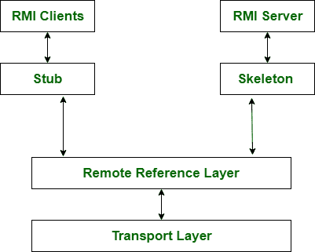

# RPC 和 RMI 的区别

> 原文:[https://www . geesforgeks . org/RPC 和-rmi 之间的差异/](https://www.geeksforgeeks.org/difference-between-rpc-and-rmi/)

**RPC** 代表**远程过程调用**，支持过程编程。在软件允许进程管理共享信息的情况下，Tt 的几乎类似于 IPC 机制。在完全不同的进程在不同的系统上执行单元死刑，并且基本上需要基于消息的通信的情况下，与环境相关联。

上图显示了中国实施的工作步骤。

**RMI** 代表**远程方法调用**，类似于 PRC，但它支持面向对象编程，这是 java 的特性。允许线程决定外来对象的策略。在 RMI 中，对象是作为参数而不是普通数据传递的。

此图显示了 RMI 协议的客户机-服务器体系结构。

RPC 和 RMI 都很相似，但是 RPC 和 RMI 的基本区别在于 RPC 支持过程式编程，另一方面 RMI 支持面向对象编程。

让我们看看 RPC 和 RMI 之间的区别:

| S.NO | 位置遥控(remote position control) | 无线电磁指示器（Radio Magnetic Indicator 的缩写） |
| --- | --- | --- |
| 1. | RPC 是一个库和操作系统相关的平台。 | 而它是一个 java 平台。 |
| 2. | RPC 支持过程编程。 | RMI 支持面向对象编程。 |
| 3. | 与 RMI 相比，RPC 的效率较低。 | 而 RMI 比 RPC 更高效。 |
| 4. | RPC 会产生更多的开销。 | 同时它产生的开销比 RPC 少。 |
| 5. | 在 RPC 中传递的参数是普通的或正常的数据。 | 而在 RMI 中，对象作为参数传递。 |
| 6. | RPC 是 RMI 的旧版本。 | 而它是 RPC 的后继版本。 |
| 7. | 在 RPC 中有很高的编程简易性。 | 而 RMI 中编程的简易性很低。 |
| 8. | RPC 不提供任何安全性。 | 同时提供客户端级别的安全性。 |
| 9. | 它的开发成本巨大。 | 而它的开发成本是公平合理的。 |
| 10. | RPC 中存在一个巨大的版本控制问题。 | 虽然有可能使用 RDMI 版本控制。 |
| 11. | RPC 中的简单应用需要多个代码。 | 虽然在 RMI 中简单的应用不需要多个代码。 |