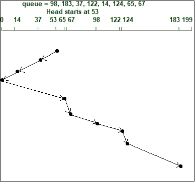
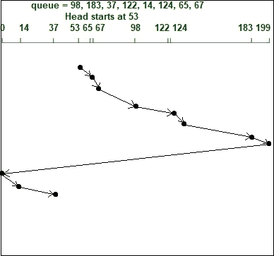

# SCAN 和 CSCAN 磁盘调度算法的区别

> 原文:[https://www . geesforgeks . org/扫描和 cscan 磁盘调度算法之间的差异/](https://www.geeksforgeeks.org/difference-between-scan-and-cscan-disk-scheduling-algorithms/)

先决条件–[磁盘调度算法](https://www.geeksforgeeks.org/disk-scheduling-algorithms/)

**1。[扫描盘调度算法](https://www.geeksforgeeks.org/scan-elevator-disk-scheduling-algorithms/?ref=rp) :**
扫描盘调度算法又称**电梯算法**。在这种情况下，磁头或指针可以在两个方向上移动，即磁盘臂开始从磁盘的一端移动到另一端，服务于所有请求，直到它到达磁盘的另一端。到达另一端后，磁头移动方向反转，并继续为请求提供服务。

这样做的问题是，它需要比 C-SCAN 调度算法更长的等待时间来请求位置。

**例:**
假设头部从 53 开始向左端移动。



头部运动总数，

```
= (53-37)+(37-14)+(14-0)+(65-0)+(67-65)
             +(98-67)+(122-98)+(124-122)+(183-124)
= 236 
```

**2。 [C-SCAN 磁盘调度算法](https://www.geeksforgeeks.org/c-scan-disk-scheduling-algorithm/) :**
在 C-SCAN 磁盘调度算法中，与 SCAN 算法唯一不同的是，它旨在提供更均匀的等待时间。在这种情况下，头或指针在单个方向上工作，即它一路扫描请求到一个方向，一旦到达末端，它跳回到另一端，并在相同的方向上服务请求，不像扫描，它在反向和正向都这样做。

**例:**
假设头部从 53 开始向右端移动。



头部运动总数，

```
= (65-53)+(67-65)+(98-67)+(122-98)+(124-122)
            +(183-124)+(199-183)+(199-0)+(14-0)+(37-14)
= 382 
```

让我们看看 SCAN 和 C-SCAN 磁盘调度算法的区别–

| 南号码 | 扫描调度算法 | 扫描调度算法 |
| --- | --- | --- |
| 1. | 它也被称为电梯算法。 | 它也被称为圆形电梯算法。 |
| 2. | 它服务于两个方向的所有请求。 | 它只在一个方向上服务请求。 |
| 3. | 在上面的扫描算法的例子中，头部从 53 开始向左移动，服务于该方向上的所有请求，并且进一步，到达左端，它将头部方向改变为向右，并且进一步服务于从 0 到 199 的所有请求。 | 在上面的 C-SCAN 算法示例中，磁头从 53 开始向右移动，服务于该方向上的所有请求，在到达右端后，它不会反转方向，而是跳到磁盘的另一端，服务于其右侧的请求。 |
| 4. | 扫描算法提供了更长的等待时间来请求位置。 | C-SCAN 算法通过电梯算法在请求位置时提供了统一的等待时间。 |
| 5. | 它具有更高的吞吐量，并提供低方差响应时间。 | 该算法提供了更好的响应时间。 |